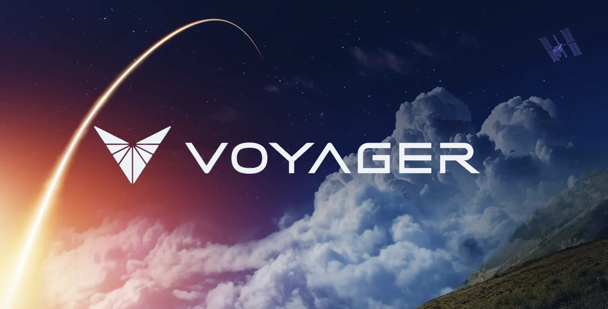

# About SHIRE

Software & Hardware Integration Runtime Environment (SHIRE) is an open-source design reference mission developed by Voyager Technologies to ease the barrier of entry to space system development. 

SHIRE is not a replacement for hardware testing — it complements and amplifies it. 
Use SHIRE to discover problems earlier, shorten the hardware validation window, and increase the number of safe test iterations you can run.

## Mission & Philosophy

Voyager is pioneering transformative, **mission ready** solutions that redefine possibilities for space, defense and national security.
SHIRE has been released in an effort to democratize access to high-quality space system development tools through pragmatic, open-source, software-first infrastructure that scales from CubeSats to interplanetary missions.

## Relevant Research Papers

* [Bailey et al., "Advancement In Space Cybersecurity" (2025).](https://aerospace.org/sites/default/files/2025-05/AdvancementInSpaceCybersecurity_Bailey_20250506.pdf)
    * **“All spacecraft developments should include digital twin development as a default approach when developing or acquiring a spacecraft.”**
* [Grubb, Matthew D., "Increasing the Reliability of Software Systems on Small Satellites Using Software-Based Simulation of the Embedded System" (2021). Graduate Theses, Dissertations, and Problem Reports.](https://researchrepository.wvu.edu/etd/8062)
    * “NOS3 was able to increase the STF-1 development team’s control of the software development schedule and to demonstrate how future software development effort schedules can be shifted ahead of the receipt of hardware components.”
* [Spolaor et al., "NOS3: The STF-1 CubeSat Case Study" (2019).](https://jossonline.com/storage/2021/08/Final-Spolaor-NASA-Operational-Simulator-for-Small-Satellites-NOS3-The-STF-1-CubeSat-Case-Study.pdf)
    * “The NOS3 environment contributed to the success of the STF-1 mission in several ways, such as reducing the mission’s reliance on hardware, increasing available test resources, and supporting training and risk reduction targeted testing of critical software behaviors on the simulated platform.”

## Why use digital-twin tools like SHIRE?

Digital-twin and simulator-first approaches are increasingly recommended in aerospace and defense because they let teams develop, test, and validate complex systems earlier, more safely, and at lower cost.
The references above highlight recurring benefits: reduced hardware dependency, earlier discovery of integration issues, improved test coverage, and accelerated schedules. In practice, SHIRE provides:

* Early, parallel development: teams can write and validate FSW and GSW before hardware availability.
* Risk reduction and fault injection: repeatable fault scenarios allow teams to validate recovery and safety logic without endangering hardware.
* Training and procedures rehearsal: operators can rehearse sequences and handovers with realistic telemetry and timing.
* Reproducible CI and regression testing: deterministic time control and scripted scenarios enable automated system tests.

## Which disciplines benefit?

* Developers
    * Rapid feedback loops: run unit, component, and integrated tests locally against component simulators. Debug algorithms with realistic inputs from 42 and other sims.
* Integration & Test (I&T)
    * End-to-end validation: exercise interfaces (CCSDS, command/telemetry), exercise file transfers (CF), and validate timing across links before hardware arrives.
* Operations
    * Procedures and ops training: build and run mission procedures (stacks) to exercise nominal and off-nominal flows; develop runbooks with confidence.
* Verification & Validation (V&V)
    * Increase test coverage: run fuzzing, long-duration tests, and regression suites that would be expensive or risky on hardware.
* New personnel / Training
    * Onboard new engineers and operators with a safe, resettable environment where mistakes don't break hardware or mission timelines.
* Researchers and Academia
    * Rapid experimentation: integrate new control laws, autonomy modules, or payload algorithms into a realistic mission stack and evaluate system-level impacts.
* Cybersecurity
    * Attack surface testing: simulate networked interactions and practice incident response and recovery on a realistic but isolated system.

## Common use cases

* Day-one integration: start software and test harness development immediately using simulators and templates.
* CI-driven system tests: run scenario tests on each change to catch regressions early.
* Procedure development & acceptance testing: operators and engineers validate checklists and procedures against a predictable simulated vehicle.
* Fault injection campaigns: validate failure detection and recovery across multiple subsystems.

New uses and users are reported regularly!
Can you think of any?
