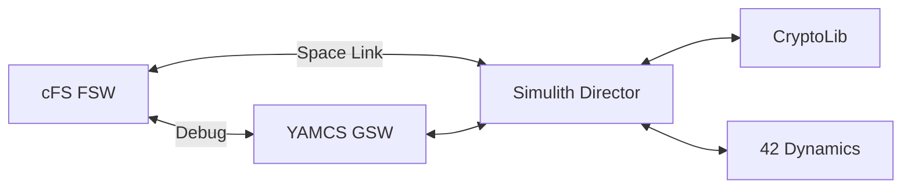
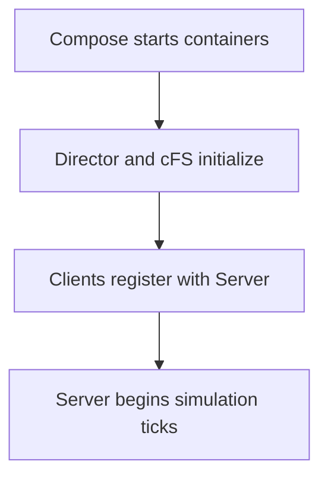
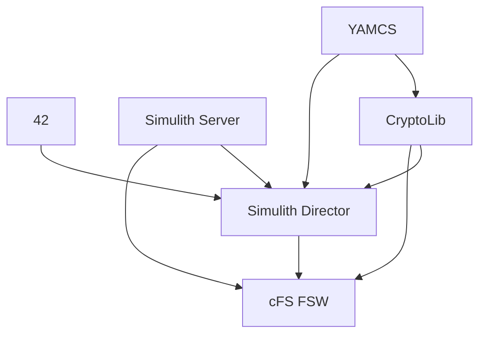
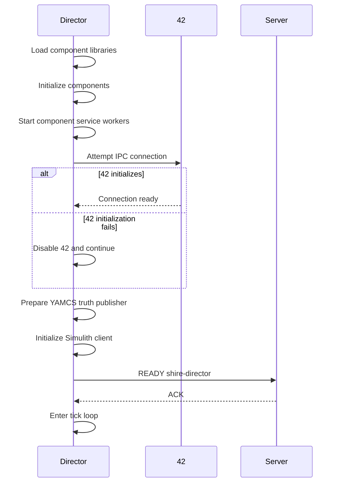
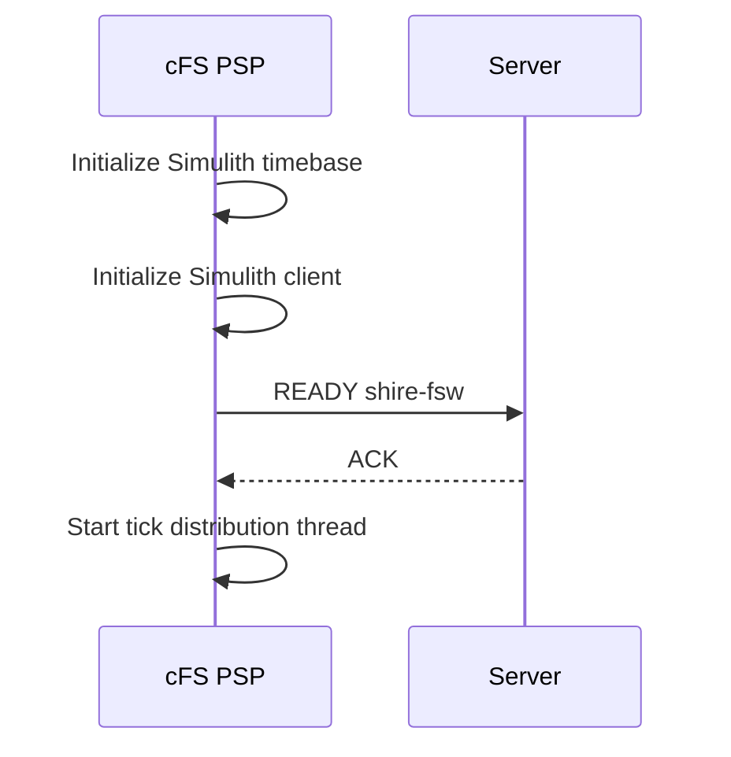
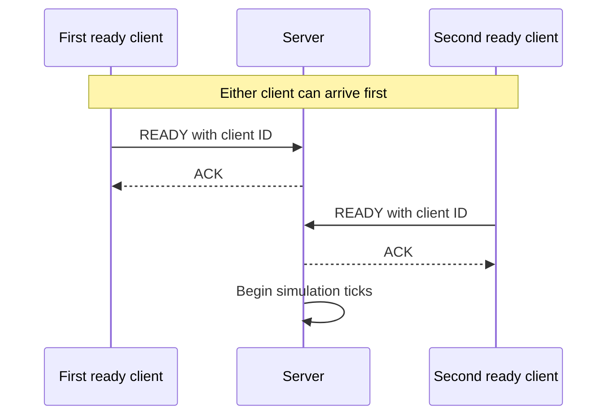
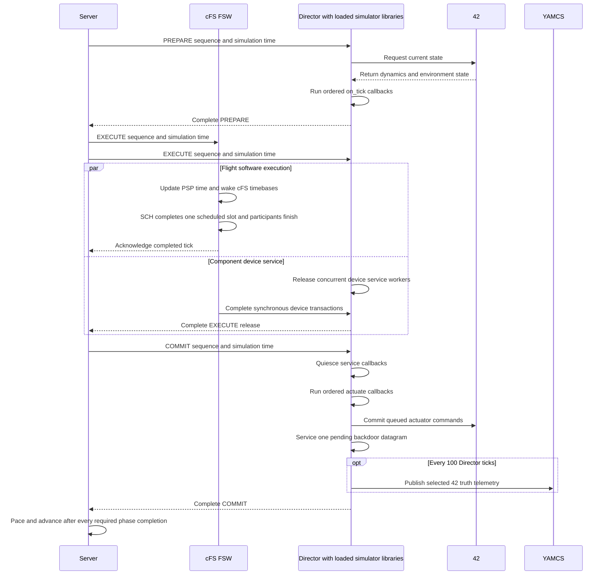
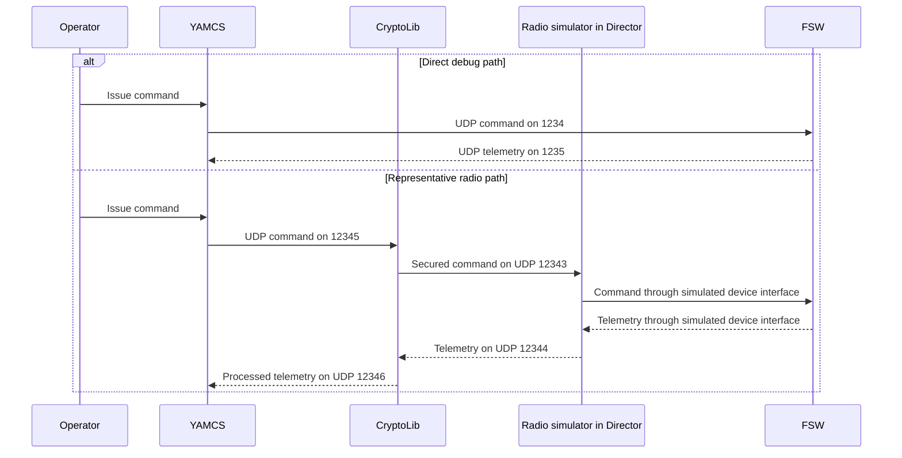

# System Architecture

SHIRE connects flight software, spacecraft dynamics, simulated components, security processing, and ground software inside a synchronized Docker environment.
The default DRM topology is generated from `cfg/shire-compose.j2` after a mission, spacecraft, and scenario are selected.

## Runtime services

The generated DRM compose file currently defines six services:

| Service | Current responsibility |
| --- | --- |
| `shire-42` | Runs the 42 dynamics and environment model with its VNC web interface exposed on port 5801 by default. |
| `shire-director` | Loads configured component simulator `.so` libraries, runs ordered sensing and actuation callbacks plus concurrent device service workers, exchanges state and commands with 42, services simulator backdoor commands, and publishes 42 truth data. |
| `shire-server` | Owns Simulith simulation time and advances the 10 ms tick only after all required PREPARE, EXECUTE, and COMMIT completions. |
| `shire-fsw` | Runs the cFS mission build, including reusable cFS applications and the component applications selected for the spacecraft. |
| `shire-cryptolib` | Applies security processing in the simulated radio command and telemetry path. |
| `shire-gsw` | Runs YAMCS for commanding, telemetry, archives, procedures, displays, and CFDP file transfer with its web interface exposed on port 8090. |

Service and container names include mission or spacecraft values in several places.
Use the generated compose file and `docker compose ps` rather than assuming a fixed container name.
Component simulators do not appear as separate services or processes.
The Director loads their shared libraries into its own address space and owns their state and worker threads.
The overview below emphasizes primary command, telemetry, device, security, and dynamics relationships.
Simulith Server timing connections are shown separately in the startup and tick diagrams.

## Startup and registration

Compose starts services according to the dependencies in the generated file, but a started container is not necessarily ready to exchange data.
At a high level, startup has four stages:

### Container start order

Compose can start 42, YAMCS, and the Simulith Server independently.
The remaining container dependencies are shown below.
An arrow means that the source container must start before the destination container, not that its application must be ready.

### Director initialization

The Director loads and initializes the selected component libraries before it registers with the Server.
It starts one device service worker for each loaded component and then attempts to connect to 42.
The Director continues without 42 if that connection cannot be initialized, although 42 is expected in the default DRM.

### FSW initialization

The cFS Platform Support Package initializes its Simulith timebase client during FSW startup.
It starts the tick distribution thread only after the Server accepts its registration.

### Registration gate

Compose does not wait for Director initialization before it starts the FSW container.
Either client can therefore register first.
The default DRM Server expects two unique clients and starts broadcasting simulation time only after both are ready.

If the Server appears idle, inspect the FSW and Director logs before changing the client count.
Reducing `NUM_CLIENTS` can hide a failed service and is not a normal fix for the DRM.

## One simulation clock

The Simulith Server publishes sequence-numbered PREPARE, EXECUTE, and COMMIT
phases and waits for every client registered for each phase before it advances
time.
The Director responds only after component sensing, device service, actuation,
and the resulting 42 command commit complete.
The cFS PSP responds after SCH, every registered scheduled participant, and any
command work transitively published by those participants finish the current
slot.
The compose template sets `NUM_CLIENTS=2`: the cFS PSP registers `shire-fsw`, and the Director registers `shire-director`.

On each Director tick, the current implementation:

1. Requests the latest state from 42 during PREPARE
2. Calls each optional `on_tick` callback in a deterministic order on the
   Director thread
3. Releases EXECUTE so one worker per device-serving component blocks on socket
   readiness and services transactions while the current FSW slot runs
4. Ends EXECUTE only after SCH, scheduled participants, and transitive Software
   Bus command consumers have returned
5. Interrupts readiness waits, stops new service calls, and waits for every
   active service callback to return
6. Calls each optional `actuate` callback in a deterministic order during COMMIT
7. Sends the complete actuator command batch, or an empty command message, to 42
8. Services one pending simulator backdoor datagram
9. Periodically publishes 42 truth telemetry to YAMCS.

The complete tick includes work by both registered clients:

The server console accepts `p` to pause or resume, `+` to increase the attempted rate, and `-` to decrease it.
These are requested rates, not performance guarantees: achievable speed depends on the host and workload.

## Component and hardware interfaces

Component applications use HWLIB interfaces supplied by the cFS Platform Support Package.
The simulation implementations are under `cfs/psp/fsw/hwlib/src/sim/`.
Linux device implementations are under `cfs/psp/fsw/hwlib/src/linux/`.

Simulated UART, I2C, SPI, and GPIO interfaces use ZeroMQ pair sockets on IPC endpoints in the shared `/tmp` volume.
A component simulator library loaded in the Director binds the endpoint for its configured device address, while the FSW side HWLIB implementation connects to the same endpoint.
Each process shares one ZeroMQ context across its endpoints.
Simulation drivers use blocking exact receives with monotonic deadlines rather than sleep and poll loops.
This keeps the component protocol above HWLIB usable across simulated and physical targets, but hardware transition still requires target specific drivers, configuration, and validation.

## Ground links

The included YAMCS instance defines these lab links:

| Link | Direction and endpoint |
| --- | --- |
| Debug command | YAMCS to FSW on UDP 1234 |
| Debug telemetry | FSW to YAMCS on UDP 1235 |
| Radio command | YAMCS to CryptoLib on UDP 12345, then to the Radio simulator library inside the Director on UDP 12343 |
| Radio telemetry | Radio simulator library inside the Director to CryptoLib on UDP 12344, then to YAMCS on UDP 12346 |
| Simulator backdoor | YAMCS to Director on UDP 50060 |
| Server pause/play/speed backdoor | YAMCS to Server on UDP 50061 |
| Server status telemetry | Server to YAMCS on UDP 50043 |
| 42 truth | Director to YAMCS on UDP 50042 |

The debug path is useful for lab checkout.
The radio path exercises the simulated radio and CryptoLib pipeline and is the representative space link path in the DRM.

YAMCS prefers the representative `radio-out` path for commands.
It falls back to `debug-out` when the preferred interface is unavailable.

## Build time architecture

`cfg/shire-orchestrator.py` resolves the active mission, spacecraft, and scenario.
`cfg/shire-build.py` builds the selected component simulator shared libraries and copies them into the Director image.
It also builds the cFS and YAMCS runtime images and assembles the remaining simulation images.
See [Configuration](../how-to/configuration.md) for the exact inputs and generated outputs.

***
Last reviewed: 20260913
