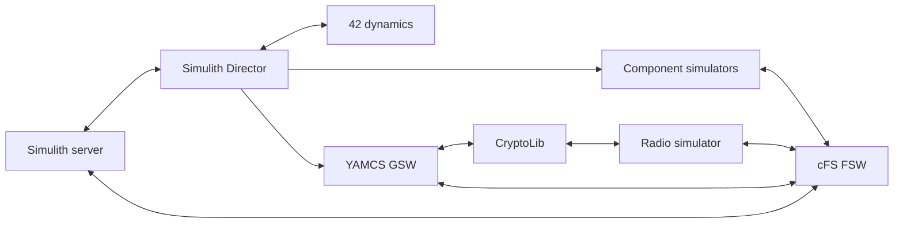
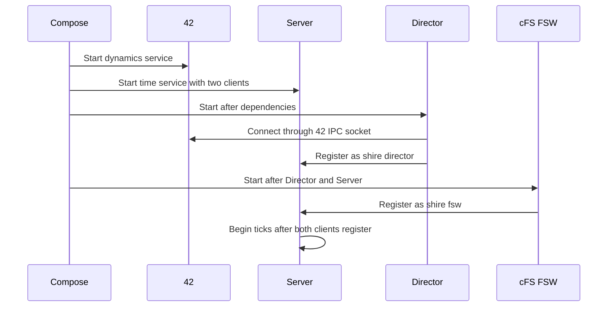
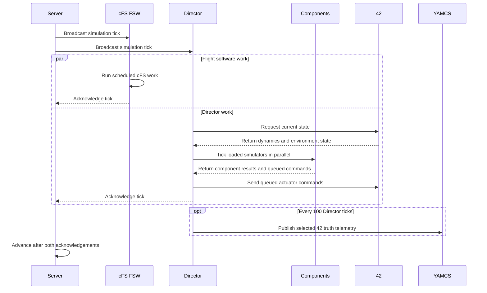
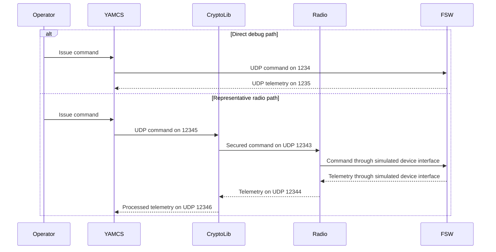

# System Architecture

SHIRE connects flight software, spacecraft dynamics, simulated components, security processing, and ground software inside a synchronized Docker environment.
The default full lab topology is generated from `cfg/shire-compose.j2` after a mission, spacecraft, and scenario are selected.

## Runtime services

The generated full lab compose file currently defines six services:

| Service | Current responsibility |
| --- | --- |
| `shire-42` | Runs the 42 dynamics and environment model with its VNC web interface exposed on port 5801 by default. |
| `shire-director` | Loads configured component simulator `.so` files, exchanges state and actuator commands with 42, ticks component simulators in parallel, services simulator backdoor commands, and publishes 42 truth data. |
| `shire-server` | Owns Simulith simulation time and waits for acknowledgements from the Director and FSW before advancing the 10 ms simulation tick in the full lab. |
| `shire-fsw` | Runs the cFS mission build, including reusable cFS applications and the component applications selected for the spacecraft. |
| `shire-cryptolib` | Applies security processing in the simulated radio command and telemetry path. |
| `shire-gsw` | Runs YAMCS for commanding, telemetry, archives, procedures, displays, and CFDP file transfer with its web interface exposed on port 8090. |

Service and container names include mission or spacecraft values in several places.
Use the generated compose file and `docker compose ps` rather than assuming a fixed container name.

## Startup and registration

Compose starts services according to the dependencies in the generated file, but a started container is not necessarily ready to exchange data.
The Director must connect to 42 and register with the Simulith Server.
The cFS PSP also registers FSW with the Server.
The full lab Server waits for both clients before advancing simulation time.

If the Server appears idle, inspect the FSW and Director logs before changing the client count.
Reducing `NUM_CLIENTS` can hide a failed service and is not a normal fix for the full lab.

## One simulation clock

The Simulith server broadcasts a tick and waits for each configured client to acknowledge completion before it advances time.
The full lab compose template sets `NUM_CLIENTS=2`: the cFS PSP registers `shire-fsw`, and the Director registers `shire-director`.

On each Director tick, the current implementation:

1. requests the latest state from 42
2. wakes one worker thread per loaded component simulator and waits for all component ticks
3. sends queued actuator commands, or an empty command message, to 42
4. services one pending simulator backdoor datagram
5. periodically publishes 42 truth telemetry to YAMCS.

The complete tick includes work by both registered clients:

The server console accepts `p` to pause or resume, `+` to increase the attempted rate, and `-` to decrease it.
These are requested rates, not performance guarantees: achievable speed depends on the host and workload.

## Component and hardware interfaces

Component applications use HWLIB interfaces supplied by the cFS Platform Support Package.
The simulation implementations are under `cfs/psp/fsw/hwlib/src/sim/`.
Linux device implementations are under `cfs/psp/fsw/hwlib/src/linux/`.

Simulated UART, I2C, SPI, and GPIO interfaces use ZeroMQ pair sockets on IPC endpoints in the shared `/tmp` volume.
A component simulator binds the endpoint for its configured device address, while the FSW side HWLIB implementation connects to the same endpoint.
This keeps the component protocol above HWLIB usable across simulated and physical targets, but hardware transition still requires target specific drivers, configuration, and validation.

## Ground links

The included YAMCS instance defines these lab links:

| Link | Direction and endpoint |
| --- | --- |
| Debug command | YAMCS to FSW on UDP 1234 |
| Debug telemetry | FSW to YAMCS on UDP 1235 |
| Radio command | YAMCS to CryptoLib on UDP 12345, then to the radio simulator on UDP 12343 |
| Radio telemetry | Radio simulator to CryptoLib on UDP 12344, then to YAMCS on UDP 12346 |
| Simulator backdoor | YAMCS to Director on UDP 50060 |
| 42 truth | Director to YAMCS on UDP 50042 |

The debug path is useful for lab checkout.
The radio path exercises the simulated radio and CryptoLib pipeline and is the representative space link path in the DRM.

Both YAMCS command links currently consume `tc_realtime` when enabled.
A command may therefore leave YAMCS on both the debug and radio paths during a lab run.

## Build time architecture

`cfg/shire-orchestrator.py` resolves the active mission, spacecraft, and scenario.
`cfg/shire-build.py` then builds only the component simulators selected by the spacecraft, builds the cFS/YAMCS runtime images, and assembles the Director and Server images.
See [Configuration](../how-to/configuration.md) for the exact inputs and generated outputs.
