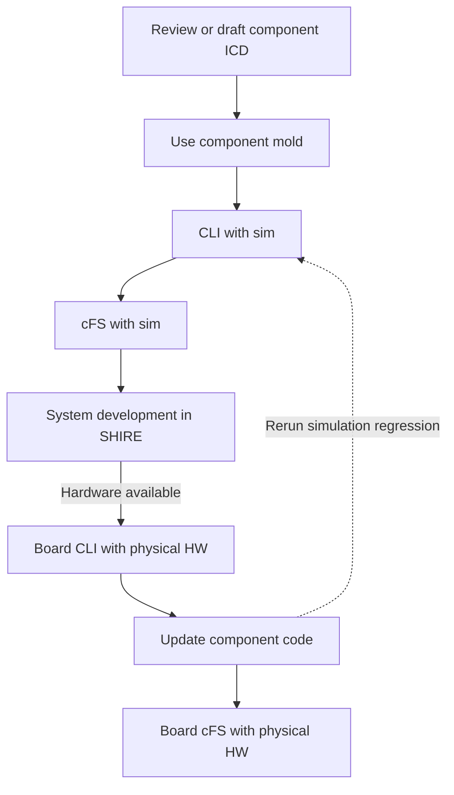

# Development Workflow

Start with one component and the smallest useful test.
Build confidence at that boundary before adding cFS, ground software, dynamics, security processing, and physical hardware.
This keeps early failures close to the code that caused them while allowing system development to continue before hardware arrives.

The same component should grow through each stage rather than becoming separate CLI, simulator, flight software, and hardware efforts.
Keep its protocol, shared code, configuration, tests, and ground definitions aligned as the test environment expands.



## One component to a complete system

### 1 - Review the template and create the component mold

Begin with the component interface rather than the complete spacecraft.
Review the hardware documentation and write down the bus, command framing, responses, configuration, state, timing, reset behavior, and expected errors.

The [`comp/demo/`](../how-to/components.md#current-reference-components) tree is the repository's reference component template.
It demonstrates how one component keeps its CLI, shared device protocol, simulator, cFS application, tests, configuration templates, XTCE, displays, and procedures together.

Create a new component from that template with the [Component Mold](../how-to/component-mold.md):

```bash
make mold COMP=my_component
```

The mold copies the Demo tree, omits generated and temporary files, renames Demo files and symbols, and applies fixed UART and message identifier substitutions.
Those substitutions are mechanical starting values rather than allocated identifiers.
The mold does not replace Demo behavior, prove identifier uniqueness, add the component to a spacecraft, update cFS mission files, or register its XTCE with YAMCS.
Complete the mold integration checklist before treating the new component as buildable in SHIRE.

### 2 - Run the CLI with the simulator

Use the command line interface to isolate the component before cFS or YAMCS can obscure a protocol problem.
The CLI and simulator provide the fastest place to refine command formatting, telemetry interpretation, configuration, timeouts, and error handling.

Select the component as `cli` in `build/active.yaml`, then run:

```bash
make cfg
make cli
make cli-start
```

Repeat this checkout as the device contract changes.
Run `make cfg` before `make test-sim` so `build/build.yaml` contains the intended spacecraft and component selection.

Put reusable framing and interpretation code under the component's `shared/` directory where practical.
The CLI and cFS application should exercise the same contract rather than implementing similar protocols independently.

### 3 - Run cFS with the simulator

Once the focused CLI behaves correctly, integrate the component application with cFS while keeping the same simulator on the other side of HWLIB.
Add the required message identifiers, startup entries, scheduler entries, telemetry subscriptions, XTCE, and focused YAMCS procedure.

Verify the simulator and flight software paths together:

```bash
make cfg
make test-sim
make test-fsw
make
make start
```

Compare equivalent CLI and cFS operations against the simulator.
Any difference should come from intentional application behavior rather than drift in the device protocol.

### 4 - Continue system development in SHIRE

Hardware availability does not block system integration.
After the component works through cFS and its simulator, continue developing the spacecraft configuration, YAMCS procedures, operational scenarios, fault responses, and interactions with other components entirely in SHIRE.

Use repeatable simulation runs to mature application behavior and system tests while the board or physical component is unavailable.
Record simulator assumptions so they can be checked when hardware arrives.
The simulator is a development model and does not replace physical hardware testing.

### 5 - Run the board CLI with the physical component

When a development board and physical component become available, return to the smallest useful boundary first.
Run the component CLI on the board with the intended hardware transport before placing cFS, Software Bus traffic, scheduling, and ground links around it.

This focused checkout should confirm real framing, byte order, timing, startup state, reset behavior, invalid input, timeout, and recovery behavior.
Update the shared device code when the hardware reveals behavior that both the CLI and cFS application need.

The current root `make cli` target builds the host simulation environment.
A board CLI still requires a reviewed target compiler, sysroot, HWLIB transport, device configuration, deployment method, and runtime permissions.

### 6 - Reconcile the simulator and run cFS on the board

Treat the physical component as the source of truth for its interface.
Compare the hardware evidence with the simulator, then update the simulator and its tests to represent relevant hardware behavior.
Document behavior that cannot or should not be modeled at the current fidelity.

Rerun the CLI and cFS simulation tests after every hardware driven correction.
This preserves SHIRE as the repeatable system development environment even when access to the physical hardware is limited.

After the focused board CLI passes, integrate the component with cFS on the development board and repeat the same component procedure through the intended flight stack.
The repository contains ARM and CPU2 scaffolding, but board CLI and board cFS execution still require target specific implementation and validation.
Use the gates and evidence guidance in this workflow when moving from simulation to physical hardware.

## Supported build targets

| Command | Current behavior |
| --- | --- |
| `make cfg` | Resolves configuration and writes generated artifacts. |
| `make list` | Reports the resolved target and enabled component build features. |
| `make sim` | Builds 42, Simulith, selected component simulator libraries, and the Director and Server images. |
| `make fsw` | Builds the configured cFS target and FSW runtime image. |
| `make gsw` | Builds CryptoLib and the YAMCS runtime image. |
| `make` | Runs configuration, then builds simulation, FSW, and GSW. |
| `make cli` | Builds 42, Simulith, the selected component simulator, the Director and Server images, and the selected host CLI image. |
| `make test-sim` | Builds Simulith, runs simulator tests selected from the existing `build/build.yaml`, and produces combined simulator coverage. |
| `make test-simulith` | Runs the standalone Simulith core suite and produces its coverage report. |
| `make test-fsw` | Builds and runs cFS/application tests and produces coverage output. |
| `make complexity` | Writes the informational `pmccabe` report to `build/coverage-complexity.txt`. |

## Coverage baseline

The GCC 14 coverage baseline established by these commands is:

| Scope | Line | Branch | MC/DC | Policy |
| --- | ---: | ---: | ---: | --- |
| Deployed SHIRE FSW | 84.8% | 84.4% | 84.3% | Informational project baseline |
| Repository component FSW | 97.5% | 88.0% | 87.1% | Included in deployed FSW |
| Component simulators | 95.3% | 82.1% | 80.0% | No-regression baseline |
| Simulith | 75.0% | 57.5% | 57.6% | Includes zero-hit standalone entry points |

Coverage traces use an explicit production allowlist and merge an initial
zero-count trace with executed counters, so compiled but unexecuted production
sources remain in the denominator.
Codecov receives separate `fsw`, `component-sim`, and `simulith` uploads.
Project coverage is informational.
Changed lines must meet the blocking 80% patch target.
MC/DC and the sorted cyclomatic-complexity report are review artifacts rather
than gates.

## What stays and what changes

| Layer | Expected transition |
| --- | --- |
| Device packet and register contract | Keep the shared contract when it matches the physical device and revise it when the simulator simplified real behavior. |
| Component cFS application | Reuse application logic where possible and verify timing, concurrency, error handling, and resource use on the target. |
| Component simulator | Keep it for development and regression testing but do not include it as flight hardware evidence. |
| HWLIB transport | Replace the simulation transport with the implementation for the target bus and operating environment. |
| PSP, BSP, and OSAL selection | Select implementations appropriate for the processor, board, and operating system. |
| Generated device configuration | Replace simulated endpoints with reviewed bus, address, pin, rate, timeout, and device settings. |
| XTCE and procedures | Keep command and telemetry definitions synchronized with the deployed application and verify procedures against target telemetry. |

## Hardware transition checklist

1. Identify every behavior that the simulator simplifies or omits.
2. Freeze or revise the device interface contract against the hardware specification.
3. Exercise the physical device with a focused CLI and the intended transport implementation.
4. Verify startup, reset, nominal traffic, invalid traffic, timeout, and recovery behavior.
5. Measure latency, throughput, jitter, and resource use on the target.
6. Build cFS with the intended PSP, BSP, OSAL, HWLIB, and startup configuration.
7. Repeat component and system procedures with recorded target evidence.
8. Keep simulator regression tests for behaviors shared by simulation and hardware.

The [Development Board](../how-to/development-board.md) page describes the ARM scaffolding currently present in the repository.
It is integration guidance rather than evidence of a validated board deployment.
The progression on this page organizes mold, simulation, CLI, cFS, and hardware work into review gates.

## Component lifecycle

SHIRE currently develops its first party hardware models in this repository under `comp/`.
The stages below describe a possible path for reusable components.
They do not claim that ADCS, Demo, EPS, or Radio have already moved to separate repositories.

### Development in this repository

This is the implemented model today.
Keeping a component in SHIRE allows one change to update its simulator, cFS application, ground definitions, command line client, and tests together.

Start from the component mold:

```bash
make mold COMP=my_comp
```

The scaffold follows this layout:

```text
comp/my_comp/
  cli/        # Native command line client
  gsw/        # XTCE definitions, displays, and procedures
  sim/        # Simulith component model
  test-fsw/   # cFS application tests
  test-sim/   # Simulator tests
  src/        # cFS application implementation
  shared/     # Shared wire protocol and device interface
```

The mold deliberately does not register the component.
Complete the integration steps in [Component Mold](../how-to/component-mold.md), including configuration, identifiers, ground definitions, and tests.

Keep the component in this repository while its interfaces change frequently or changes need to remain atomic with SHIRE.

### Optional repository extraction

Once interfaces and ownership are stable, maintainers may choose to extract a component into its own repository and reference it as a Git submodule.
That decision should define:

* a public repository and release policy
* maintainers and an issue tracker
* compatibility expectations for SHIRE revisions
* continuous integration for the standalone component and its SHIRE integration
* a documented submodule update process

Extraction adds work for contributors.
Clones must initialize the new submodule, repository pointers must be updated deliberately, and changes spanning repositories require coordinated reviews.
Validate the build and public clone workflow before adopting this model.

### External adoption

A separately released component can be forked and adapted for another mission.
This remains an ecosystem goal rather than a guarantee that the component is portable to arbitrary hardware.
Consumers must still validate wire protocols, identifiers, timing, device drivers, cFS configuration, and ground definitions for their target.

| Stage | Location | Repository status |
| --- | --- | --- |
| Development in SHIRE | `comp/<name>/` | Implemented for ADCS, Demo, EPS, and Radio |
| Repository extraction | Separate repository referenced as a submodule | Optional future maintenance choice |
| External adoption | Consumer fork or pinned release | Ecosystem goal with target validation required |

## Automation status

`.github/workflows/ci.yml` runs on pull requests and pushes to `main` or `dev`.
It defines separate Simulith, FSW, and CLI build jobs, runs the FSW, component
simulator, and Simulith core test builds, and uploads their explicitly scoped
coverage to Codecov.
`.github/workflows/docs.yml` validates the Atlas on pull requests and pushes to `main` or `dev`.
It publishes GitHub Pages only after a successful push build on `main`.

These jobs do not currently run the YAMCS submodule tests or a complete DRM scenario.
When a CI result is used as evidence, retain the workflow run, logs, coverage, resolved configuration, container image, and revision identifiers rather than treating the presence of the workflow file as a passing result.

***
Last reviewed: 20260817
