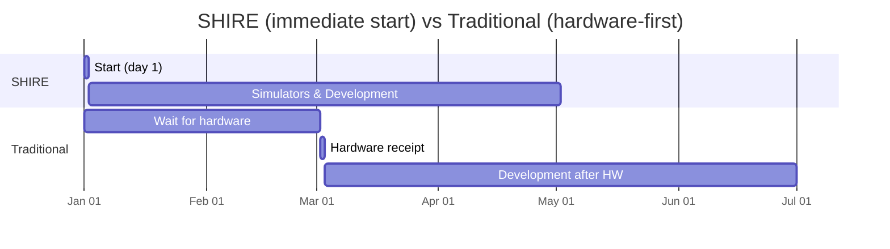
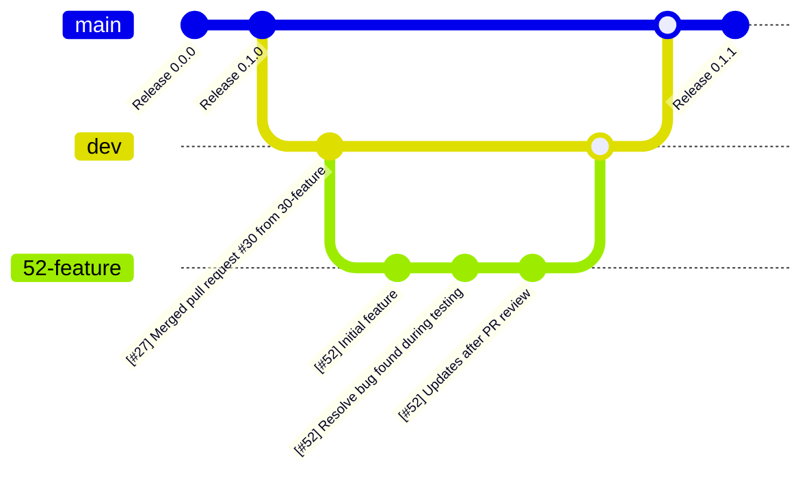

# Development Workflow

SHIRE enables the entire lifecycle of mission development by providing simulators, templates, and CI-ready build flows so teams can begin meaningful mission work from day one, before hardware arrives.

## Missions

SHIRE is built to accelerate mission development across assembly, integration, test, and operations.
The key is that a design reference mission, simulators, and templates let teams start on software, system integration, and test automation immediately.

* Assembly 
    * Teams can begin integration and software development before hardware is available.
    * This shortens risk discovery and reduces idle time when hardware is delayed.
* Integration
    * End-to-end testing with a simulator enables iterative workflows and earlier discovery of integration issues (interfaces, timing, data formats).
* Test
    * Simulators allow exploration of failure modes and recovery strategies that are impractical or unsafe on real hardware.
* Operations
    * Long duration runs, automation tuning, and operator familiarization can be done using the same software stack used for flight.

## Development timeline (visual)

The diagram below emphasizes the difference in timeline and schedule shift left caused by SHIRE.
You can start development on day one and have a tool useful throughout the mission.
Traditionally the team must wait until hardware is available and requires hardware time to confirm development is functional.

SHIRE enables productive simulator-driven work from day one.

## Build Types

SHIRE supports an iterative set of build types so that teams can develop, test, and validate at the right fidelity for each phase:

* Command Line Interface (CLI)
    * The start of a library to be re-used directly by the FSW application.
    * Used for initial checkout of the hardware and any quick checks without need for a complete FSW solution.
* Continuous Integration (CI)
    * Automated pipelines that run unit, integration, and system tests on each change.
    * CI can include simulator-driven system tests that mimic operational scenarios.
* SHIRE Simulations
    * Fast iteration builds that produce simulator artifacts and mock interfaces.
    * Ideal for developer feedback loops and system integration testing without hardware.
* Processor In Loop (PIL) SHIRE Simulations
    * Prove your processor can run the desired algorithms.
    * Get a baseline for performance without additional I/O interface overheads.
* Flight
    * Create your flight binaries you'd deploy on the space vehicle.
    
## Git workflow and conventions

A consistent Git workflow improves review speed and traceability.
The following conventions are recommended and already present across the repository:

* Branching
    * All feature work branches should be created from `dev` (development branch).
    * Branch names should include the issue number or short identifier, e.g. `#52-telemetry-improvements`.
* Commits
    * Commit messages should begin with the issue reference: `[#52] Short description`.
    * Make incremental commits with clear messages; squash at merge time if needed.
* Pull / Merge Requests
    * File a Merge Request / Pull Request for review before merging into `dev`.
    * Prefer squashing feature branch commits when merging to keep `dev` history clean.
* Releases
    * Periodically merge `dev` into `main` for formal releases; create annotated tags (e.g. `v1.2.0`).

----
Last updated: 20251202
