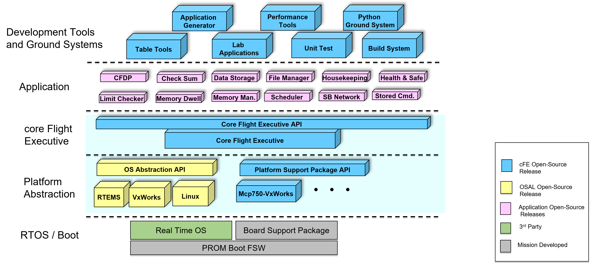

# Flight Software

This document outlines the Flight Software (FSW) architecture used within the SHIRE environment.
The system leverages the NASA core Flight System (cFS) to provide a platform-independent, layered architecture for satellite operations.

## cFS Architecture

The core Flight System has a little `c` due to its small core.
The architecture is divided into distinct layers that separate application logic from the underlying hardware and operating system.
This ensures portability and simplifies testing across different targets (e.g., simulation vs. flight hardware).

The following bullets detail the sections shown above from the bottom up:

* RTOS/Boot Layer
    * Provides the operating system services, device drivers, and C library that the cFS depends on.
    * Supported operating systems include VxWorks, RTEMS, and Linux. Most flight projects use a real time operating system.
* OS Abstraction Layer (OSAL)
    * A software library that provides a single Application Program Interface (API) to the core Flight Executive (cFE) regardless of the underlying real-time operating system.
* Platform Support Package (PSP) 
    * A software library that provides a single Application Program Interface (API) to underlying avionics hardware and board support package. It contains startup code, interfaces to hardware such as nonvolatile memory, watchdog, and timers.
* core Flight Executive (cFE)
    * A portable, platform-independent framework that creates an application runtime environment by providing services that are common to most flight applications.
* Applications
    * Provide mission functionality using a combination of cFS community apps and mission-specific apps.
* Development tools and ground systems
    * Used to test and run the cFS.
    * A variety of ground systems can be used with cFS.
    * Ground system and tool selection generally vary by project.

## cFE and cFS

Clarifying the difference: cFE vs cFS

- cFE (core Flight Executive)
    - The cFE is the lightweight runtime and services layer: it provides the executive, inter-process services (events, software bus, tables, time), and the minimal framework applications rely on. Think of cFE as the operating-system-like runtime and service set for flight applications.
- cFS (core Flight System)
    - The cFS is the full system bundle: it includes the cFE plus a set of reusable apps, platform support (PSP), OS abstraction (OSAL), libraries, and ground/utility tools. cFS = cFE + apps + platform glue + utilities.

In short: cFE is the runtime and service layer; cFS is the complete ecosystem (runtime + apps + platform support).

cFE Services include:

* Executive Services
    * The core runtime: task/process management, application lifecycle (start/stop), and overall system control.
* Event Services
    * Centralized event reporting, filtering, and logging used by apps and the executive for diagnostics and alerts.
* Software Bus
    * A publish/subscribe message bus used by applications to exchange telemetry, commands, and housekeeping data.
* Table Services
    * Manage editable parameter tables (images) that apps can read and update; supports ground updates and memory persistence.
* Time Services
    * Provide consistent spacecraft time, time stamping, and time-related APIs used by scheduled actions and telemetry.

Below are the cFS libraries and applications included with SHIRE (`./cfg/shire_defs/cpu1_cfe_es_startup.scr`), with a short description for each.

* Libraries
    * cryptolib - Cryptography library used by mission software for crypto primitives and secure services.
    * hwlib - Hardware support library exposing common hardware interfaces used by apps in SHIRE.
    * io_lib - Input/output utilities and helpers used by applications for device and file I/O.
* cFS Applications
    * CF, CCSDS File Delivery Protocol - Implements file transfer services (reliable delivery, uplink/download, CFDP behavior) and manages file movement between ground and flight storage.
    * DS, Data Storage - Telemetry and data recorder that stores packets to persistent files for playback, post-processing, and ground analysis.
    * FM, File Manager - Manages file system operations (listing, removal, housekeeping), storage space, and provides APIs for other apps to manipulate files.
    * LC, Limit Checker - Monitors telemetry values against predefined limits and generates events or actions when limits are exceeded.
    * SC, Stored Command - Manages sequences of stored commands (macros), enabling playback of command sequences at scheduled times or on-demand.
    * SCH, Scheduler - Provides time-tagged scheduling services that trigger commands or stored sequences at specific times or intervals.
    * CI_LAB, Command Ingest Lab - A lab or debug command ingest app variant used for operator command injection during integration and testing (lab harness variant of CI).
    * TO_LAB, Telemetry Output Lab - A lab or debug telemetry output app used for formatting and forwarding telemetry during integration and test activities.
* Component Applications
    * ADCS, Attitude Determination & Control System - Mission ADCS application responsible for sensor fusion, attitude estimation, and actuator commands for pointing and stabilization.
    * DEMO, Demonstration - Example payload or demonstration application included for functional testing and as a template for new apps.
    * EPS, Electrical Power System - Manages power telemetry, power control, battery charging/discharging algorithms, and related health metrics.
    * RADIO, Radio Communications - Handles radio modem interfaces, uplink/downlink message handling, and RF telemetry/command conversion.

Notes and caveats

* The descriptions above are intentionally concise. 
    * For full details, consult each application's README or source under the corresponding component folder (e.g., `fsw/apps/*`, `comp/*`).
* Some app names are mission-specific variants (e.g., `ci_lab`, `to_lab`) intended for lab/integration use. 
    * Their behavior is usually similar to the standard CI/TO apps but with extra hooks for testing or different I/O targets.
* cFS has a number of other standardized applications.
    * Use them wisely.
* It is expected that the generic components will be updated to COTS products on a per mission basis.
    * These generics are just to showcase the capability and enable the design reference mission for research and development.

----
Last updated: 20251202
