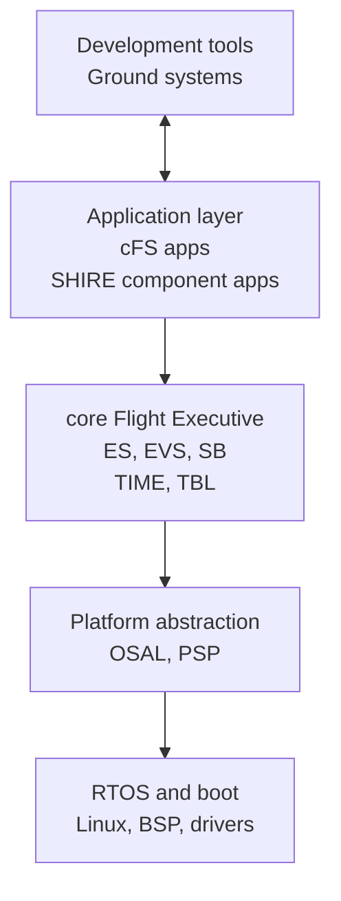
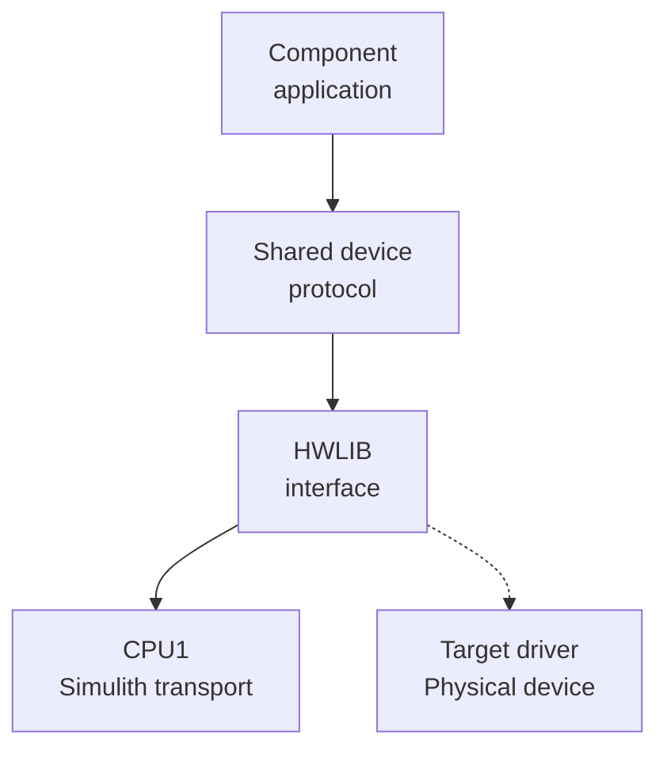

# Flight Software

SHIRE uses NASA's core Flight System (cFS) as its DRM flight software framework.
The current simulation target runs cFS on the SHIRE PSP/OSAL configuration inside the `shire-fsw` container.
An alternate flight software framework would need its own build and runtime integration, Simulith timing client, device interfaces, and command and telemetry paths.
The repository does not currently include another integrated flight software framework.

## cFS architecture layers

cFS separates mission behavior from the operating system and hardware that run it.
Each lower layer provides a stable interface to the layer above it so applications can move between supported targets with less platform specific code.
The diagram shows responsibility layers rather than every function call.



| Layer | Responsibility in SHIRE |
| --- | --- |
| Development tools and ground systems | Tools build, configure, test, command, monitor, and operate the flight software, with YAMCS serving as the DRM ground system. |
| Application | Reusable cFS applications provide common mission functions while SHIRE component applications provide spacecraft specific behavior. |
| core Flight Executive | Executive Services, Event Services, Software Bus, Time Services, and Table Services provide the portable application runtime. |
| Platform abstraction | OSAL presents a common operating system API while the PSP handles startup, timebase, memory, watchdog, and platform services. |
| RTOS and boot | The operating system, board support, boot environment, C library, and device drivers support the abstraction layer, with CPU1 currently using the SHIRE Linux configuration. |

### Where SHIRE hardware interfaces fit

HWLIB is a hardware interface library inside the PSP source tree rather than a separate standard cFS architecture layer.
Component applications call shared device code, which uses HWLIB interfaces for UART, I2C, SPI, GPIO, sockets, memory, CAN, and torquers.



The enabled CPU1 SHIRE PSP compiles the simulation implementations from `cfs/psp/fsw/hwlib/src/sim/` and links them with Simulith and ZeroMQ.
Linux HWLIB implementations also exist under `cfs/psp/fsw/hwlib/src/linux/`, but the disabled CPU2 cFS target does not currently assemble them into a validated board build.
Moving to physical hardware therefore requires target specific PSP, OSAL, board support, driver, configuration, and deployment work.

## Current mission content

The baseline CPU1 startup script is `cfg/shire_defs/cpu1_cfe_es_startup.scr`.
It declares:

| Type | Included content |
| --- | --- |
| Libraries | CryptoLib and IO_LIB |
| Reusable cFS applications | CF, DS, FM, LC, SC, SCH, CI_LAB, and TO_LAB |
| SHIRE component applications | ADCS, Demo, EPS, and Radio |

During configuration, the orchestrator copies the mission definitions to `build/<mission>/<spacecraft>/shire_defs/` and removes ADCS, Demo, EPS, or Radio startup entries that are not selected by that spacecraft.
Other reusable applications remain in the startup script.

`cfg/shire_defs/targets.cmake` defines the build targets and application set.
Mission tables under `cfg/shire_defs/tables/` configure scheduler messages, subscriptions, data storage, limit checking, stored commands, radio routing, and CFDP behavior.

## Command and telemetry flow

Component applications receive CCSDS and cFS messages on the Software Bus.
They translate application commands into device operations through HWLIB and publish housekeeping or component telemetry back to the Software Bus.
CI_LAB and TO_LAB provide the direct debug link to YAMCS.
The Radio component provides the simulated radio path.

Reusable applications add mission services:

* **CF** provides CFDP file transfer behavior.
* **DS** records selected packets to files.
* **FM** exposes file system operations.
* **LC** evaluates watchpoints and can initiate configured actions.
* **SC** executes absolute and relative command sequences.
* **SCH** produces scheduled wakeups and commands.

## Build and test

From the repository root:

```bash
make fsw
make test-fsw
```

`make fsw` builds the configured cFS target and its runtime image.
`make test-fsw` performs a clean test build, runs CTest, collects LCOV data, and generates an HTML coverage report under the configured FSW build tree.

The presence of CPU2 and ARM toolchain definitions demonstrates cross build scaffolding, but successful deployment to a board depends on the selected target, BSP, drivers, and hardware specific validation.
See [Development Board](../how-to/development-board.md) for the currently documented board workflow.

***
Last reviewed: 20260817
