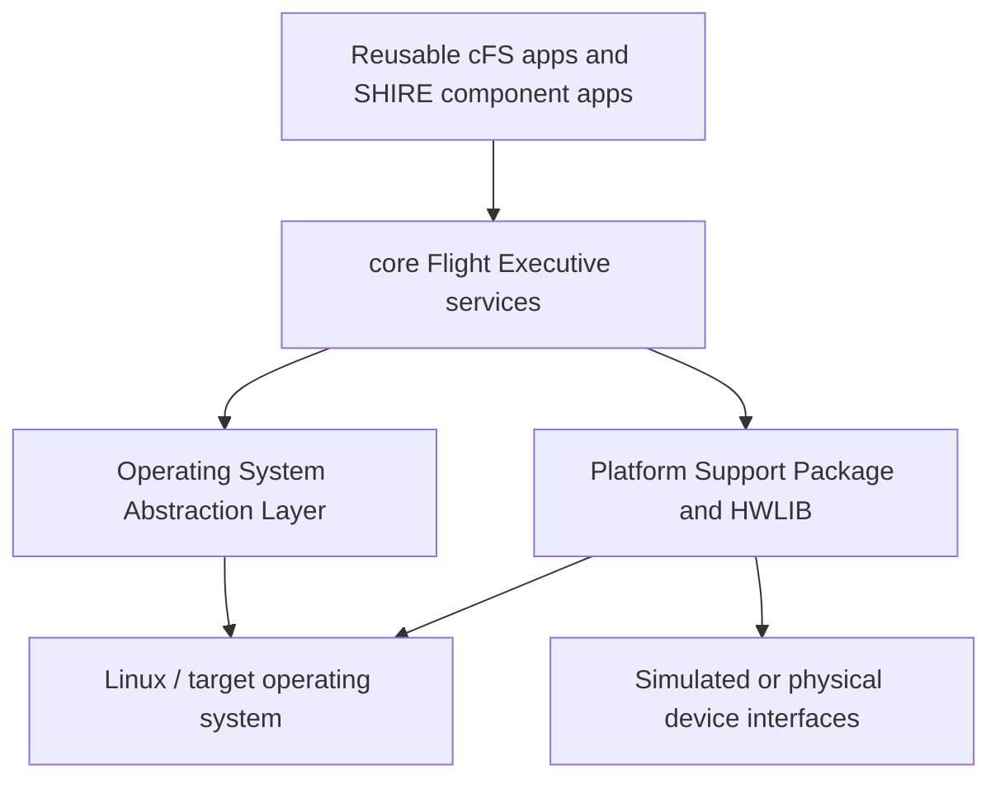

# Flight Software

SHIRE uses NASA's core Flight System (cFS) as its flight software framework.
The current simulation target runs cFS on the SHIRE PSP/OSAL configuration inside the `shire-fsw` container.

## cFS layers in this repository



* **cFE** supplies Executive, Event, Software Bus, Table, and Time services to applications.
* **OSAL** isolates cFE and applications from operating system APIs.
* **PSP** supplies platform startup, timebase, and board facing services.
* **HWLIB** is included under `cfs/psp/fsw/hwlib/` and exposes UART, I2C, SPI, GPIO, socket, memory, CAN, and torque interfaces.
  The `sim` and `linux` implementations select different transports below the same interface.

## Current mission content

The baseline CPU1 startup script is `cfg/shire_defs/cpu1_cfe_es_startup.scr`.
It declares:

| Type | Included content |
| --- | --- |
| Libraries | CryptoLib and IO_LIB |
| Reusable cFS applications | CF, DS, FM, LC, SC, SCH, CI_LAB, and TO_LAB |
| SHIRE component applications | ADCS, Demo, EPS, and Radio |

During configuration, the orchestrator copies the mission definitions to `build/<mission>/<spacecraft>/shire_defs/` and removes ADCS, Demo, EPS, or Radio startup entries that are not selected by that spacecraft.
Other reusable applications remain in the startup script.

`cfg/shire_defs/targets.cmake` defines the build targets and application set.
Mission tables under `cfg/shire_defs/tables/` configure scheduler messages, subscriptions, data storage, limit checking, stored commands, radio routing, and CFDP behavior.

## Command and telemetry flow

Component applications receive CCSDS and cFS messages on the Software Bus.
They translate application commands into device operations through HWLIB and publish housekeeping or component telemetry back to the Software Bus.
CI_LAB and TO_LAB provide the direct debug link to YAMCS.
The Radio component provides the simulated radio path.

Reusable applications add mission services:

* **CF** provides CFDP file transfer behavior.
* **DS** records selected packets to files.
* **FM** exposes file system operations.
* **LC** evaluates watchpoints and can initiate configured actions.
* **SC** executes absolute and relative command sequences.
* **SCH** produces scheduled wakeups and commands.

## Build and test

From the repository root:

```bash
make fsw
make test-fsw
```

`make fsw` builds the configured cFS target and its runtime image.
`make test-fsw` performs a clean test build, runs CTest, collects LCOV data, and generates an HTML coverage report under the configured FSW build tree.

The presence of CPU2 and ARM toolchain definitions demonstrates cross build scaffolding, but successful deployment to a board depends on the selected target, BSP, drivers, and hardware specific validation.
See [Development Board](../how-to/development-board.md) for the currently documented board workflow.
