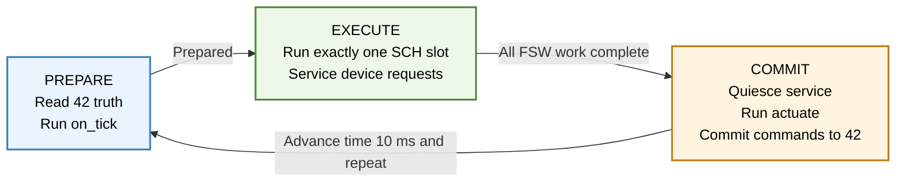
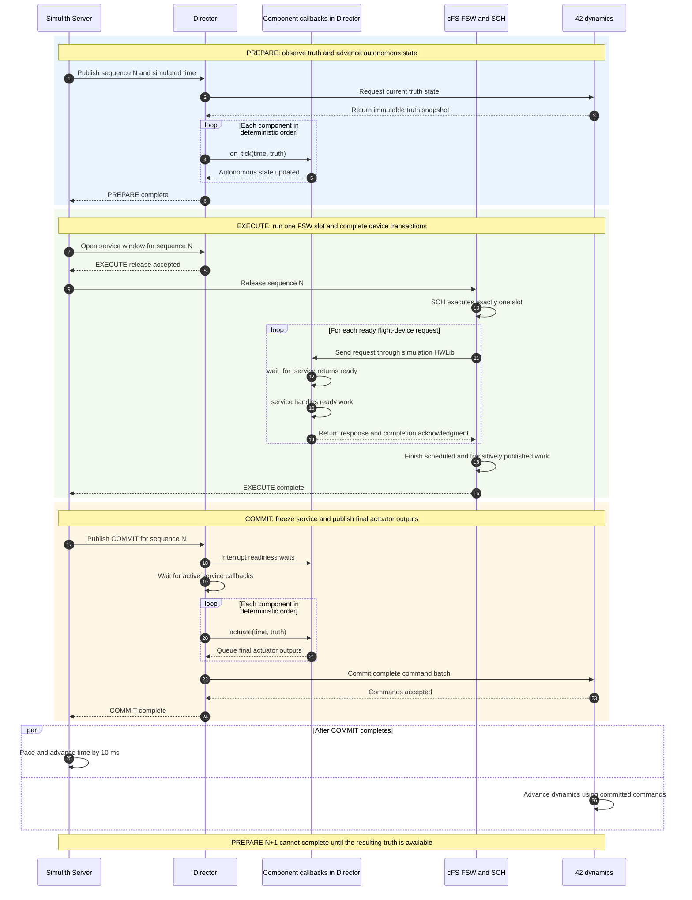

# Simulations

SHIRE's simulation layer consists of the Simulith Server, the Director process with its loaded component simulator libraries, and the separate 42 dynamics process.

## Simulith Server

The Server owns simulation time.
Its current tick interval is 10 ms.
For every tick it:

1. Publishes the sequence and current simulated time for PREPARE
2. Waits for every client registered for PREPARE
3. Publishes EXECUTE and waits for registered FSW and Director completion
4. Publishes COMMIT and waits for the Director to commit component outputs
5. Delays as needed for the requested speed
6. Advances simulated time by one interval.

The DRM expects two clients: FSW and the Director.
The focused CLI environment expects one Director client.
From the attached Server console, use `p` to pause or resume, `+` to request a faster rate, and `-` to request a slower rate.
The Server reports simulated time, attempted speed, and achieved speed every 10
seconds of simulated time regardless of the active synchronization transport.
The implementation accepts attempted rates from 1/64x through 1024x, but host performance determines the achieved rate.

## Simulith Director

The Director scans its `components` directory for shared objects.
A loadable simulator exports `get_component_interface`, which returns the lifecycle defined in `simulith/include/simulith_component.h`:

* `create` allocates and initializes private component state
* `on_tick`, when present, advances autonomous state once using the current
  simulation time and immutable 42 truth snapshot
* `wait_for_service` blocks on flight-device request readiness plus a Director
  interrupt without consuming requests
* `service` handles ready flight-device protocol requests during the FSW
  execution phase without waiting for future simulation time
* `actuate`, when present, publishes the current tick's final actuator outputs
  before the director commits the combined command batch to 42
* `destroy` releases component state after all callbacks are quiescent
* `backdoor`, when implemented, accepts commands used only for tests

Each interface also declares `SIMULITH_COMPONENT_API_VERSION` and its compiled
`sizeof(component_interface_t)`.
The Director rejects a library whose version,
size, required lifecycle callbacks, or component name does not match the active
contract.
An API change therefore requires a clean rebuild of every component.
An old shared object is never called through a guessed layout.

Mutable model data, transport endpoints, GPIO state, timing deadlines, and
deterministic random-generator state belong to the allocated component state.
The current ADCS, Demo, EPS, and Radio simulators follow this ownership rule.

### Tick loop at a glance

Every synchronized tick follows the same closed-loop cycle:



The Server advances the clock only after every required completion for the
current phase has arrived.

### Detailed tick sequence

The callbacks occupy distinct synchronization boundaries.
The following sequence shows one complete tick and how the Server's phases map
to the component-facing API:



The same flow expressed as component responsibilities is:

1. During PREPARE, the Director calls `on_tick` once for each component in a
   deterministic order.
2. During EXECUTE, one worker per device-serving component blocks in
   `wait_for_service` and calls `service` only for ready work.
3. During COMMIT, the Director prevents new service calls, waits for active
   calls to return, and calls `actuate` once for each component in a
   deterministic order.
4. The Director commits the resulting command batch to 42 before completing
   the tick.

`on_tick` is for autonomous state evolution and may be omitted by a strictly
request-driven component.
The current 42 truth snapshot is also available to `service`, which permits a
sensor to calculate data only when FSW requests it.
`actuate` is for components that drive 42 and may be omitted by components with
no actuator output.
Keeping it separate prevents an early or partial command publication while FSW
is still changing the component's commanded state.

The Director creates one service worker thread per loaded component that
provides the paired readiness/service callbacks.
Only device service runs concurrently across components.
The small `on_tick` and `actuate` callbacks run on the Director thread to avoid
worker wake and barrier overhead while retaining deterministic ordering.
The build script copies only simulators selected for the active spacecraft into the Director image.
At runtime the Director loads each library with `dlopen` and owns its component state.
The loaded simulators are not separate processes or Simulith Server clients.

`service` handles the currently ready request set without waiting and returns
`COMPONENT_WORK`, `COMPONENT_IDLE`, or `COMPONENT_ERROR`.
A modeled protocol rejection is completed through the device protocol and
returns `COMPONENT_WORK` because the simulator itself did not fail.
A synchronous transaction must complete within the current tick.
For a modeled operation that spans several ticks, the device accepts or rejects
the request immediately, stores operation state, advances that state in
`on_tick`, and exposes progress through later status requests.
Holding a synchronous request open until a future tick would deadlock the
closed-loop barrier.

## 42 integration

42 runs as a separate container.
The Director exchanges state and actuator commands with it through a Unix domain socket in the shared Simulith volume.
The context exposed to component simulators includes simulation and dynamics time, position, velocity, attitude quaternion, body rates, sun and magnetic field vectors, eclipse state, mass properties, and atmospheric density.

Examples in the current component models include:

* ADCS uses 42 attitude, rate, sun, and magnetic field state and queues magnetorquer and reaction wheel commands back to 42.
* EPS derives simulated solar generation from the 42 sun vector and eclipse flag.
* Demo maps the body frame sun vector into three representative data channels unless random data injection is enabled.

The Director also publishes a 42 truth packet to YAMCS on UDP 50042 every 100 Director ticks.

## Simulated device transport

HWLIB's simulation drivers communicate with the simulator libraries loaded inside the Director over ZeroMQ IPC endpoints in the shared `/tmp` volume.
Endpoint families are reserved for UART, I2C, SPI, and GPIO.
Each endpoint is derived from the configured device handle, bus, address, chip select, or pin.
All endpoints in one process share a single ZeroMQ context.
Blocking exact receives use monotonic deadlines and support partial responses,
timeouts, rejection, and shutdown interruption without application-side polling.

For example, Demo uses a UART endpoint based on `SIMULITH_UART_BASE_PORT + DEMO_CFG_HANDLE`.
The simulator binds the endpoint, while the FSW side UART driver connects to it.
The same Demo device packet format is used by the simulator, the cFS application, and the developer CLI.

## Synchronized completion

FSW participates in EXECUTE once per 10 ms tick.
SCH releases exactly one slot and the PSP records registration-to-dispatch and
dispatch-to-return latency for each participant.
When an active participant publishes a Software Bus command to a task-activation
pipe, the cFE SB and PSP integration registers a child completion for that
destination subscriber.
The tick therefore cannot finish merely because CI_LAB or another producer
returned while work it published remains queued.

This same-tick completion rule applies to task-activation pipes.
A pipe used only with `CFE_SB_POLL` is instead a durable input queue: delivery remains
lossless, but the queued data is consumed under the application's next
scheduled activation.
For example, Radio may enqueue several CFDP PDUs on a CF
channel pipe during one tick, while CF intentionally drains that pipe on its
later CF wakeup.
Such queued data does not hold the originating tick open.
The scheduled activation that processes it is itself synchronized.

The Server rejects duplicate, stale, future, wrong-phase, and unknown
completions.
Its watchdog names the client holding a phase, while the PSP watchdog identifies
the schedule entry, message ID, and participant state holding EXECUTE.
No synchronized mode batches ticks, queues future ticks, or skips SCH slots.

## Performance regression runs

See [Synchronized Simulation Performance](../how-to/performance.md) for the
diagnose-first findings, accepted workload, report contents, and current
workstation results.

Run the complete active workload from the repository root:

```bash
make perf-smoke
make perf
make perf-compare BASELINE=/path/to/accepted-report.json
```

`make perf-smoke` runs one short diagnostic trial.
`make perf` runs a 75 simulated second workload at 1x and 25x followed by three
unbounded trials.
The Director injects ADCS ENABLE at sequence 2000 and SUNSAFE at sequence 2200
as validated CCSDS packets through the normal CI_LAB UDP port.
This performance scenario file is independent of the DRM configuration scenario
selected in `build/active.yaml`.
Each command uses flat `sequence`, `host`, `port`, and `packet_hex` transport
fields.
Optional flat `acceptance_app`, `acceptance_event_id`, and
`acceptance_count` fields identify the existing cFE EVS success event that the
performance harness counts as application acceptance.
These fields are assertions over normal flight behavior, not simulation hooks
in an application.

The performance report schema records root and submodule revisions (including dirty
tree and untracked-file hashes), captured CMake/compiler flags and image identities, host and Docker
metadata, scheduling policies, timestamped continuous resource samples,
explicit scenario-command Software Bus delivery counts and scenario-declared
application success-event counts, 5-us latency histograms with explicit
out-of-range counts,
phase and participant latencies, device transactions, scenario results, queue
errors, and terminal-state digests.
Deterministic command deliveries, including all scenario commands, are compared
exactly.
The report-declared periodic ground-output wakeup remains visible but
is compared through exact `due = sent + throttled` accounting because its
sent/throttled split is intentionally wall-clock paced.
Generated reports and profiler captures are stored in timestamped, untracked
directories under `build/performance/` by default.
The comparison target also requires `BASELINE` and fails on synchronization or
fidelity differences, an unbounded trial below 25x, or a median throughput
regression greater than ten percent.

The standalone Server also accepts `--speed <factor|max>`, `--duration`,
`--warmup`, and `--metrics-json` while retaining the positional client count and
interactive controls.

## Fault injection

The Director listens for backdoor datagrams on UDP 50060 and dispatches a valid packet to the named component's `backdoor` callback.
Backdoor behavior is specific to each component.
Demo currently supports changing its device configuration and toggling randomized housekeeping or data.
A backdoor is a test interface, not a flight interface, and should only be used in isolated simulation runs.

## Tests

Simulation tests are present in `simulith/test/` and `comp/<name>/test-sim/`.
Run the selected component simulator tests and combined coverage from the repository root:

```bash
make test-sim
```

`make test-sim` builds the Simulith executables needed by the component tests, but it does not run the separate Simulith core test suite.
Run that suite from the repository root with `make test-simulith` (or directly
with `make -C simulith test`).
Both simulation suites produce line, branch, and MC/DC HTML reports and a
separate Codecov-compatible LCOV trace.
A passing unit test does not by itself verify a complete mission scenario.
Record the configuration, revision, command, and result for any formal verification claim.

***
Last reviewed: 20260914
