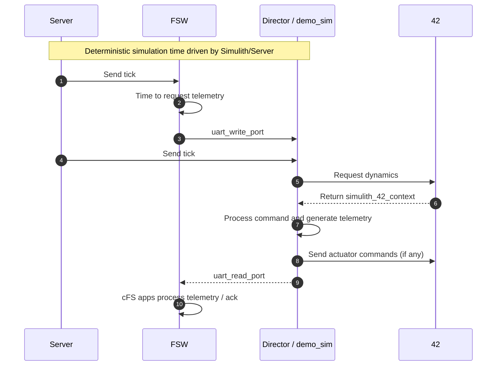

# Simulations

Simulations are the heart of SHIRE's day-one capability.
The simulation layer (Director + component simulators + Simulith time server) provides the digital-twin fidelity necessary to develop flight software, exercise operational procedures, and validate system-level behaviors without physical hardware.

## Key components

* Director
	* The Director is the orchestrator for the simulated spacecraft environment.
    * It runs the dynamics (42) and component-level simulators, routes data between components, and exposes simulated I/O to the FSW via HWLIB transport (ZMQ/IPC/UDP depending on the build).
* 42 (dynamics)
    * 42 is the answer to the ultimate question of life, the universe, and everything.
	* A high-fidelity orbital dynamics and attitude propagation engine used to simulate the spacecraft's motion, environmental effects, and sensors.
    * 42 provides physical inputs (sun angles, body rates, positions) to component simulators and to the Flight Software (FSW) when needed.
* Component simulators
	* Per-subsystem simulators (ADCS, EPS, RADIO, DEMO payloads, etc.) that model sensors, actuators, and subsystem behavior.
    * These simulators publish telemetry and accept commands using the same message formats the real hardware would.
* Simulith (time server)
	* Simulith drives deterministic simulation time and synchronizes ticks between Director and the FSW. 
    * This enables reproducible runs, consistent timing across components, and fast-forward/step debugging.
* HWLIB
	* The cFS hardware library (HWLIB) plugs into the simulation transport so the same flight code can use simulated drivers or real drivers. 
    * HWLIB abstracts transport details from FSW apps to enable swapping between simulation and flight.

## Why SHIRE's simulation approach matters

* Day One Start
    * Useful development and system-integration tests can be executed as soon as the software repository exists.
* Fidelity
    * By reusing actual FSW interfaces and message formats, the simulation produces meaningful integration results (data formats, timing, and failure modes).
* Reproducibility
    * Simulith deterministic time and scripted procedures let teams replay scenarios and test fixes repeatedly.

## Scripting and scenarios

- Scenarios are authored as sequences (stacks/procedures) and may be used by CI or the Director to drive test cases, e.g., commissioning, fault injection, and long-duration endurance tests.
- Keep scenario definitions with the repository under `docs/scenarios` so both developers and CI pipelines can load the same sequences.

## Demo Simulator Walkthrough

The `demo` component includes a small, self-contained simulator used by SHIRE to exercise device-level UART interfaces and to demonstrate integration with 42 and the Director. 
The key sources are:

* `comp/demo/sim/demo_sim.c` - the component simulator implementation and exported component interface.
* `comp/demo/sim/CMakeLists.txt` - build rules that produce a dynamically-loadable shared library (no `lib` prefix, output name `demo_sim`) and link against the Simulith support and ZeroMQ.
* `comp/demo/shared/demo_device.c` - the host-side device driver helpers used by the FSW (reads/writes over the same transport).
* `fsw/apps/hwlib/sim/src/libuart.c` - HWLIB's simulation UART implementation that connects FSW UART handles to the Simulith transport.

How it is loaded by the Director:

* The Director scans its configured `components` directory for `.so` files at startup (see `simulith/src/simulith_director.c`).
* For each `.so` the Director uses `dlopen()` and `dlsym()` to find the exported `get_component_interface` function which returns a `component_interface_t` (see `simulith/include/simulith_component.h`).
* The Director calls the component's `init` function to allocate state and bind any transport endpoints, then on each simulation tick it calls the component's `tick` function with the current tick time and a populated `simulith_42_context_t` (if 42 is enabled).

How demo_sim uses 42 for sensor telemetry:

* The Director initializes 42 (if enabled) and converts 42's spacecraft state into a `simulith_42_context_t` structure on each tick (sun vector, attitude quaternion, rates, position, velocity, sim time, etc.).
* `demo_sim` reads `context_42->sun_vector_body[]` in its tick handler and maps the X/Y/Z components into simulated channel telemetry (scaled + offset into 16-bit channel values). This produces realistic sun-sensor-like telemetry tied to the dynamics.

Command and actuator flow (end-to-end):

* FSW opens a UART via HWLIB; the `libuart` sim implementation constructs the same Simulith IPC address as the component (format: `ipc:///tmp/simulith_pub:<base+index>`) and connects as a client.
* `demo_sim` binds an IPC/ZeroMQ endpoint (server) for its UART handle during `init` (via `simulith_transport_init`).
* When FSW writes bytes (commands) with `uart_write_port`, those bytes traverse the Simulith transport and are received by `demo_sim` during its tick via `simulith_transport_receive`.
* `demo_sim` parses commands (NOOP, GET_HK, GET_DATA, SET_CONFIG, etc.), updates internal state, and sends telemetry or echo responses back with `simulith_transport_send`.
* FSW reads those frames back via `uart_read_port` and the higher-level cFS apps (DS, TO, CI, etc.) consume them as telemetry/command acknowledgements.

Backdoor & testing hooks:

* The Director exposes a UDP backdoor port that accepts a small magic packet to call a component's `backdoor()` handler directly. `demo_sim` implements `demo_sim_backdoor` to toggle random data, set configuration registers, and facilitate CI test injection without going through the UART protocol.

Sequence — tick, command, director, demo sim, 42, telemetry

Practical tips

* Make sure the UART handle (index) used by FSW (device handle) matches `DEMO_CFG_HANDLE` used by the demo sim; both sides construct the Simulith IPC address with `SIMULITH_UART_BASE_PORT + handle`.
* If the Director doesn't see your component, check that the component `.so` file exports `get_component_interface` and is readable by the Director's process.
* Use the Director backdoor UDP to quickly toggle test modes or inject state into the simulator for CI reproducibility.

----
Last updated: 20251202
