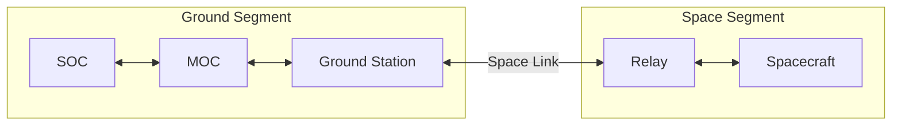

# Space System Crash Course

A space system can be divided into a space segment and a ground segment.
The space segment contains the spacecraft and relays.
The ground segment contains the mission operations center, science operations center, and ground station.
The space link connects the two segments through radio frequency or optical communication.

SHIRE focuses on the software visible parts of this system.
It models spacecraft dynamics, flight software, component interfaces, a radio path, and ground software.
It does not model a qualified antenna, modem, ground station, or complete physical communication channel.
The minimum level of fidelity needed to close requirements or perform the desired testing is recommended to enable maximum performance.

## What crosses the space link

Physical space links use antennas, radio hardware, and modems on the spacecraft and ground.
SHIRE replaces those physical elements with a software radio model and UDP transport.

Telemetry and commands commonly use packet and frame formats such as those defined by the Consultative Committee for Space Data Systems (CCSDS) Space Packet standard.
The current SHIRE ground and flight configuration includes CCSDS packet handling and CCSDS File Delivery Protocol (CFDP) services.
CFDP Class 2 adds acknowledgements and retransmission to its file transfer flow provided by class 1.

The Radio component provides Sleep, Transmit, Receive, and Duplex modes.
The DRM uses RTS 6 to create a fixed pass window by selecting Duplex mode for 480 seconds before returning to Receive mode.
This window is not calculated from ground station visibility.

## Spacecraft bus and payload

The spacecraft bus contains the services needed to operate the vehicle.
Common bus functions include command and data handling, power, communication, attitude control, and thermal control.

The payload performs the mission specific work.
SHIRE uses the Demo or demonstration component as its reference payload.
The Demo application and simulator provide commands, housekeeping, and three representative data channels mimicing an instrument grade magnetometer.

## The Spacecraft Bus

The current DRM represents these bus functions:

* **Attitude Determination and Control:** the ADCS component consumes 42 state and can send actuator commands back to 42.
* **Command and Data Handling:** cFS, reusable cFS applications, and component applications run in the FSW service.
* **Communication:** the Radio component models command uplink, telemetry downlink, buffering, and operating modes.
* **Electrical Power System:** the EPS component models solar generation, battery state, and switched loads.

The current DRM does not include a separate thermal control component.
Thermal gradients, heaters, coolers, and temperature sensor dynamics are outside the implemented baseline.

***
Last reviewed: 20260817
