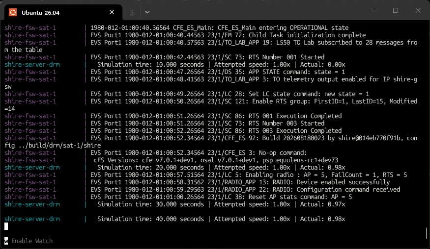
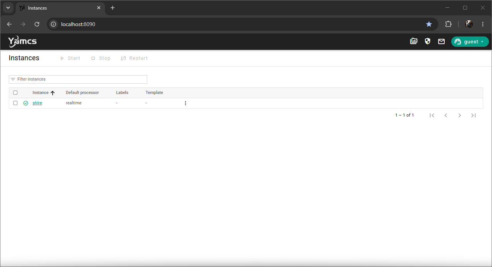
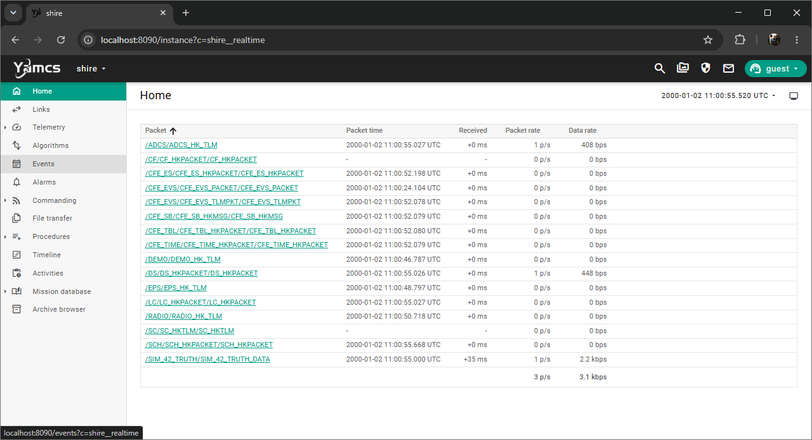
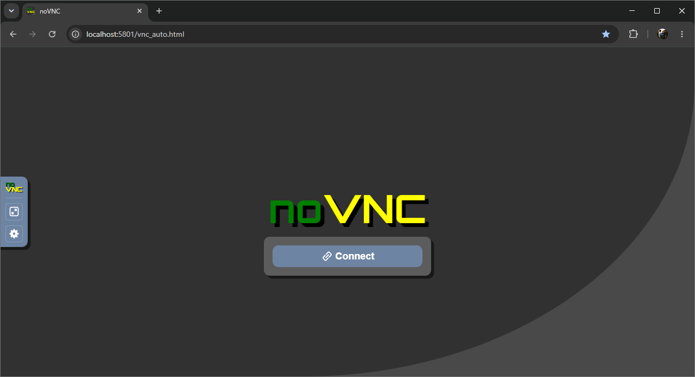
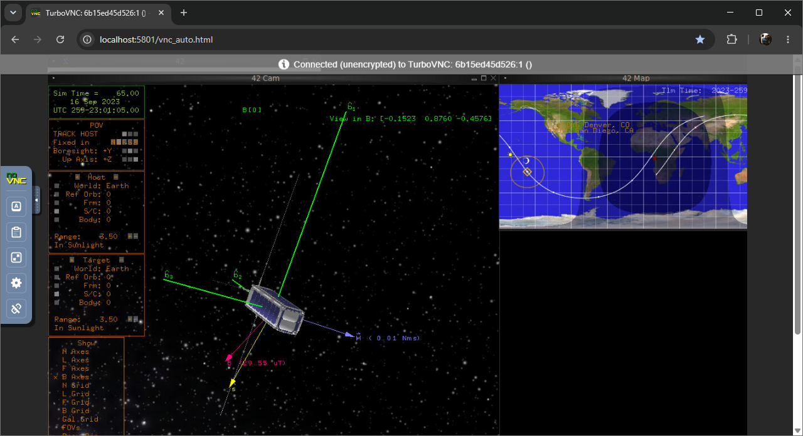

# Getting Started

This walkthrough starts the default DRM `sat-1` lab.

## Clone

```bash
git clone --recurse-submodules https://github.com/VoyagerTechnologies-Public/shire.git
cd shire
```

If the repository was cloned without submodules:

```bash
git submodule update --init --recursive
```

## Configure and build

```bash
make cfg
make list
make
```

The first run pulls or builds several container images and compiles cFS, YAMCS, Simulith, 42, CryptoLib, and the selected component simulators.
It can take substantial time and disk space.

`make cfg` creates `build/active.yaml`.
`make list` should report mission `drm`, spacecraft `sat-1`, scenario `nominal`, and ADCS, Demo, EPS, and Radio components for the default selection.

## Start

```bash
make start
```

Wait for cFS, YAMCS, the Director, and the Server to finish their startup handshakes.

The Compose output should show the automatic SC, LC, TO_LAB, Radio, and cFE startup activity before simulation time continues to advance.



Then open:

* YAMCS: [http://localhost:8090](http://localhost:8090)
* 42 VNC: [http://localhost:5801/vnc_auto.html](http://localhost:5801/vnc_auto.html)

YAMCS opens on the Instances page.
Select the running `shire` instance.



The YAMCS Home page should begin showing recently received packets.



Select **Links** in the left navigation.
Confirm telemetry is arriving before sending commands.

The 42 page can initially show the noVNC connection screen.
Select **Connect** to open the dynamics display.



Confirm that the spacecraft view and map appear and that simulation time advances.



The default Server container is named `shire-server-drm`.
Attach to its console to control simulation time:

```bash
docker attach shire-server-drm
```

Use `p` to pause or resume, `+` to request a faster rate, and `-` to request a slower rate.
Detach without stopping the container with `Ctrl+P`, then `Ctrl+Q`.

## Stop and resume

Press `Ctrl+C` in the Compose terminal.
Then ensure all services are stopped:

```bash
make stop
```

YAMCS data is stored in a named volume and normally survives `make stop`.
A later `make start` reuses the generated configuration and images.
Run `make` again after source or configuration changes.

Use cleanup targets deliberately:

* `make clean` removes the active mission build artifacts and stops the stack.
* `make clean-cache` prunes the Docker builder cache and attempts to remove the legacy unsuffixed `gsw-data` and `simulith_ipc` volumes.
* `make uninstall` removes SHIRE build artifacts, containers, images, volumes, and networks.

Continue with the [Commissioning scenario](../../scenarios/commissioning.md), or see [Troubleshooting](faq.md) if startup fails.

***
Last reviewed: 20260817
