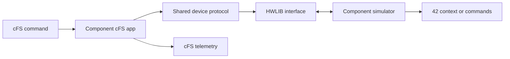

# Components

A SHIRE component keeps the artifacts needed to develop, exercise, integrate, and operate one spacecraft subsystem under `comp/<name>/`.

## Current reference components

| Component | Simulated interface | Current role |
| --- | --- | --- |
| ADCS | UART | Models an integrated attitude determination and control unit that consumes 42 truth state and can command simulated magnetorquers and reaction wheels. |
| Demo | UART | Provides a minimal reference payload and source for the component mold that echoes commands and produces representative housekeeping and three channel data. |
| EPS | I2C | Models solar generation, battery state, and eight switched loads using solar input derived from 42 sun and eclipse state. |
| Radio | SPI and GPIO | Models device commanding, buffered uplink/downlink, radio modes, and the ground radio path. |

CryptoLib is also under `comp/`, but it is integrated as an external library and standalone security processing service rather than following the same reference component mold.

The active spacecraft decides which component simulators are built and loaded and which component applications remain in the generated CPU1 startup script.
The current `cfg/shire_defs/targets.cmake` still compiles all four reference component applications into the cFS build.
See [Configuration](configuration.md#change-the-active-target).

## Standard layout

| Path | Responsibility |
| --- | --- |
| `cli/` | Focused developer checkout program and build rules |
| `gsw/` | XTCE command/telemetry definitions, displays, and YAMCS procedures |
| `mission_inc/` | Mission scoped identifiers such as performance IDs |
| `platform_inc/` | Platform scoped identifiers such as cFS message IDs |
| `src/` | cFS application source and message handling |
| `shared/` | Device protocol, framing, generated configuration, and code reusable by the app, CLI, or simulator |
| `sim/` | Director loadable component simulator |
| `support/` | Device configuration defaults/template and CLI container definition |
| `test-fsw/` | cFS application and shared code unit/coverage tests |
| `test-sim/` | Simulator lifecycle, protocol, state, and dynamics tests |

Not every component is required to implement every optional artifact, but the build expects a valid cFS CMake target, unique message/device identifiers, and a simulator interface when the component is selected for simulation.

## Device path



In simulation, HWLIB connects to a ZeroMQ IPC endpoint and the simulator binds the matching endpoint.
One ZeroMQ context is shared across all endpoints in each process, and simulated
drivers use blocking deadline-based receives.
On a physical target, a target specific HWLIB implementation performs the device I/O.
The device protocol above HWLIB should remain consistent, but transport timing and hardware behavior must be tested separately.

## Focused CLI workflow

Select the CLI component in `build/active.yaml`, then run:

```bash
make cfg
make cli
make cli-start
```

The CLI environment starts 42, one Simulith Server, one Director, the selected component simulator, and the selected CLI container.
It does not start cFS, YAMCS, or CryptoLib.

## Full integration workflow

After focused protocol and simulator checks:

```bash
make cfg
make
make start
```

The YAMCS build copies every component's XTCE, displays, and procedures into its build context.
The cFS build finds component applications through `CFS_APP_PATH=../comp`, while `cfg/shire_defs/targets.cmake` and the generated startup script control what is built and started.

## Tests

```bash
make test-sim
make test-fsw
```

`make test-sim` discovers component simulator tests from the spacecraft configuration in `build/build.yaml` and writes combined simulator coverage under `build/sim-coverage/`.
Run `make cfg` first so that snapshot matches `build/active.yaml`.
When the snapshot is absent, the Simulith Makefile uses its fallback component list.
`make test-fsw` runs the cFS/app test build and writes coverage in the configured FSW build tree.

When changing a component, keep its device protocol, cFS messages, XTCE, procedure arguments, simulator, CLI, configuration template, and tests synchronized.

## Simulator callback contract

Each simulator exports `get_component_interface()` and declares
`SIMULITH_COMPONENT_API_VERSION` plus `sizeof(component_interface_t)`.
The Director validates the version, size, unique name, and required callbacks
before creating component state.
Changing the meaning, type, or position of an interface field requires an API
version increment and a clean rebuild of every component simulator.

Use each callback for one responsibility:

| Callback | Phase | Developer responsibility |
| --- | --- | --- |
| `create` | Startup | Allocate private state and open simulator-side resources. |
| `on_tick` | PREPARE | Advance autonomous state once from the immutable 42 truth snapshot. |
| `wait_for_service` | EXECUTE | Block on device readiness and the Director interrupt without consuming the request. |
| `service` | EXECUTE | Process ready device requests without waiting for a future tick. |
| `actuate` | COMMIT | Publish the final actuator output set after current-tick FSW work is complete. |
| `destroy` | Shutdown | Close resources and release private state after callbacks are quiescent. |
| `backdoor` | Test only | Apply an isolated simulation control or fault injection when implemented. |

`on_tick` and `actuate` are optional. `wait_for_service` and `service` must be
provided together or both omitted.
A request-driven sensor can calculate its result lazily in `service` from the
current truth snapshot and leave `on_tick` null.
A component that does not command 42 can leave `actuate` null.
An actuator-producing component keeps `actuate` separate because `on_tick` runs
before FSW and `service` may run repeatedly while FSW is still updating the
commanded state.
The separate COMMIT callback publishes one deterministic final output set.

Keep all mutable model state, transport handles, deadlines, and deterministic
random-generator state in the object allocated by `create`.
The application and shared device code use the same complete synchronous
transaction contract for simulation and physical targets, while HWLIB supplies
the target-specific transport implementation.

A synchronous device request must receive its response and completion in the
current tick.
For a device operation that takes several ticks, `service` returns an immediate
accepted, busy, or rejected protocol response and stores the modeled operation
state.
`on_tick` advances that state, and later status requests observe its result.
Waiting inside a bus transaction for a future tick would deadlock the closed-loop
synchronization barrier.

The Demo simulator is the reference implementation copied by the component
mold.
Its README and prefunction comments explain lifecycle ownership, lazy sensing,
multi-tick operation state, protocol rejection, and phase-specific tests.

***
Last reviewed: 20260913
