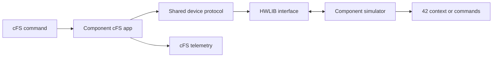

# Components

A SHIRE component keeps the artifacts needed to develop, exercise, integrate, and operate one spacecraft subsystem under `comp/<name>/`.

## Current reference components

| Component | Simulated interface | Current role |
| --- | --- | --- |
| ADCS | UART | Models an integrated attitude determination and control unit that consumes 42 truth state and can command simulated magnetorquers and reaction wheels. |
| Demo | UART | Provides a minimal reference payload and source for the component mold that echoes commands and produces representative housekeeping and three channel data. |
| EPS | I2C | Models solar generation, battery state, and eight switched loads using solar input derived from 42 sun and eclipse state. |
| Radio | SPI and GPIO | Models device commanding, buffered uplink/downlink, radio modes, and the ground radio path. |

CryptoLib is also under `comp/`, but it is integrated as an external library and standalone security processing service rather than following the same reference component mold.

The active spacecraft decides which component simulators are built and loaded and which component applications remain in the generated CPU1 startup script.
The current `cfg/shire_defs/targets.cmake` still compiles all four reference component applications into the cFS build.
See [Configuration](configuration.md#change-the-active-target).

## Standard layout

| Path | Responsibility |
| --- | --- |
| `cli/` | Focused developer checkout program and build rules |
| `gsw/` | XTCE command/telemetry definitions, displays, and YAMCS procedures |
| `mission_inc/` | Mission scoped identifiers such as performance IDs |
| `platform_inc/` | Platform scoped identifiers such as cFS message IDs |
| `src/` | cFS application source and message handling |
| `shared/` | Device protocol, framing, generated configuration, and code reusable by the app, CLI, or simulator |
| `sim/` | Director loadable component simulator |
| `support/` | Device configuration defaults/template and CLI container definition |
| `test-fsw/` | cFS application and shared code unit/coverage tests |
| `test-sim/` | Simulator lifecycle, protocol, state, and dynamics tests |

Not every component is required to implement every optional artifact, but the build expects a valid cFS CMake target, unique message/device identifiers, and a simulator interface when the component is selected for simulation.

## Device path


```mermaid
flowchart LR
    CMD[cFS command] --> APP[Component cFS app]
    APP --> SHARED[Shared device protocol]
    SHARED --> HWLIB[HWLIB interface]
    HWLIB <--> SIM[Component simulator]
    SIM --> DYNAMICS[42 context or commands]
    APP --> TLM[cFS telemetry]
```

In simulation, HWLIB connects to a ZeroMQ IPC endpoint and the simulator binds the matching endpoint.
One ZeroMQ context is shared across all endpoints in each process, and simulated
drivers use blocking deadline-based receives.
On a physical target, a target specific HWLIB implementation performs the device I/O.
The device protocol above HWLIB should remain consistent, but transport timing and hardware behavior must be tested separately.

## Focused CLI workflow

Select the CLI component in `build/active.yaml`, then run:

```bash
make cfg
make cli
make cli-start
```

The CLI environment starts 42, one Simulith Server, one Director, the selected component simulator, and the selected CLI container.
It does not start cFS, YAMCS, or CryptoLib.

## Full integration workflow

After focused protocol and simulator checks:

```bash
make cfg
make
make start
```

The YAMCS build copies every component's XTCE, displays, and procedures into its build context.
The cFS build finds component applications through `CFS_APP_PATH=../comp`, while `cfg/shire_defs/targets.cmake` and the generated startup script control what is built and started.

## Tests

```bash
make test-sim
make test-fsw
```

`make test-sim` discovers component simulator tests from the spacecraft configuration in `build/build.yaml` and writes combined simulator coverage under `build/sim-coverage/`.
Run `make cfg` first so that snapshot matches `build/active.yaml`.
When the snapshot is absent, the Simulith Makefile uses its fallback component list.
`make test-fsw` runs the cFS/app test build and writes coverage in the configured FSW build tree.

When changing a component, keep its device protocol, cFS messages, XTCE, procedure arguments, simulator, CLI, configuration template, and tests synchronized.

## Simulator callback contract

Each simulator exports `get_component_interface()` and declares
`SIMULITH_COMPONENT_API_VERSION` plus `sizeof(component_interface_t)`.
The Director validates the version, size, unique name, and required callbacks
before creating component state.
Changing the meaning, type, or position of an interface field requires an API
version increment and a clean rebuild of every component simulator.

Use each callback for one responsibility:

| Callback | Phase | Developer responsibility |
| --- | --- | --- |
| `create` | Startup | Allocate private state and open simulator-side resources. |
| `on_tick` | PREPARE | Advance autonomous state once from the immutable 42 truth snapshot. |
| `wait_for_service` | EXECUTE | Block on device readiness and the Director interrupt without consuming the request. |
| `service` | EXECUTE | Process ready device requests without waiting for a future tick. |
| `actuate` | COMMIT | Publish the final actuator output set after current-tick FSW work is complete. |
| `destroy` | Shutdown | Close resources and release private state after callbacks are quiescent. |
| `backdoor` | Test only | Apply an isolated simulation control or fault injection when implemented. |

`on_tick` and `actuate` are optional. `wait_for_service` and `service` must be
provided together or both omitted.
A request-driven sensor can calculate its result lazily in `service` from the
current truth snapshot and leave `on_tick` null.
A component that does not command 42 can leave `actuate` null.
An actuator-producing component keeps `actuate` separate because `on_tick` runs
before FSW and `service` may run repeatedly while FSW is still updating the
commanded state.
The separate COMMIT callback publishes one deterministic final output set.

Only `actuate` may enqueue 42 commands, after completed flight transactions, simulator backdoors and power transitions have been applied.
Device service and power callbacks update private pending state.
The director rejects commands queued before ACTUATE or carried over from a previous tick, rather than filtering them by component type or power state.
Each simulator emits commands only for its owned actuator indices.
On power loss it explicitly zeros those outputs so 42 does not retain a previous torque or dipole.
Other powered components retain their outputs.

Keep all mutable model state, transport handles, deadlines, and deterministic
random-generator state in the object allocated by `create`.
The application and shared device code use the same complete synchronous
transaction contract for simulation and physical targets, while HWLIB supplies
the target-specific transport implementation.

A synchronous device request must receive its response and completion in the
current tick.
For a device operation that takes several ticks, `service` returns an immediate
accepted, busy, or rejected protocol response and stores the modeled operation
state.
`on_tick` advances that state, and later status requests observe its result.
Waiting inside a bus transaction for a future tick would deadlock the closed-loop
synchronization barrier.

The Demo simulator is the reference implementation copied by the component
mold.
Its README and prefunction comments explain lifecycle ownership, lazy sensing,
multi-tick operation state, protocol rejection, and phase-specific tests.

## Power-aware component simulators

Power support connects an EPS rail to the device model behind a simulator's transport.
EPS provides the wiring and electrical configuration.
The Director applies changes at a synchronized boundary.
The consumer decides how a supply cut, boot interval, and restart affect its protocol and physical outputs.
The shared declarations are in `simulith/include/simulith_component.h` and `simulith/include/simulith_power.h`.

### Provider and consumer callbacks

The current EPS simulator implements `power_supply`.
DEMO, ADCS, and Radio implement the four consumer callbacks below.
A mapped consumer must provide all four even if it has no autonomous updates or actuators.
A component that is not mapped by EPS can leave these callbacks null.
The Director resolves each load's `component` against the simulator interface name, such as `demo_sim`.

| Callback | When called | Purpose and implementation rules |
| --- | --- | --- |
| `power_supply(state)` | Startup and power accounting | Return the provider-owned persistent `simulith_power_supply_t` containing load mappings, rail states, queued transitions, and consumer snapshots for the Director to consume or fill. |
| `power_configure(state, config)` | Startup and every COMMIT | Copy resolved electrical settings, entering managed state only on the first call and preserving device configuration, boot deadlines, supply state, and counters on later updates. |
| `power_set(state, on, ns)` | Startup and ordered switch transitions at COMMIT | Apply effective supply state at simulated time `ns`, resetting volatile state on actual edges and starting boot on an ON edge while preserving state and deadlines for unchanged supply. |
| `power_reset(state, ns)` | Explicit reset transitions at COMMIT | Clear volatile device state and rebase model deadlines even without a supply edge, preserving transports, mapping, supply state, boot deadline, and power diagnostic history. |
| `power_snapshot(state, ns, out)` | Startup, before PREPARE model updates, and after COMMIT power changes | Query readiness, mode, request/cycle history, and watts for internal accounting without consuming transport data, resetting the model, advancing noise, or publishing actuator commands. |

A consumer leaves `power_supply` null.
The Director consumes the provider's transition queue and fills its consumer snapshots.
Consumer resets restore deterministic noise state where applicable.
The four consumer callbacks return `COMPONENT_SUCCESS` for a correctly handled operation.
Use `COMPONENT_ERROR` for invalid callback arguments or simulator failures.
A normal power cut or unfinished boot is valid modeled behavior.
`power_supply` instead returns the provider-owned pointer.
Its storage must remain valid until the provider is destroyed.
EPS flight service and backdoors queue rail operations for the Director rather than calling consumer callbacks from device-service workers.
`power_set` receives the effective physical state, which can differ from the requested state under a stuck-switch fault.

### State helpers and electrical demand

Keep a `simulith_power_runtime_t` inside the state allocated by `create`.
The shared inline helpers provide the common mechanics.
The consumer callback wrappers add device-specific reset and mode behavior.

| Helper | How to use it |
| --- | --- |
| `simulith_power_configure(&power, config)` | Copy the load settings, initializing `managed`, supply OFF and the physical enable gate on the first call while preserving runtime state on subsequent calls. |
| `simulith_power_set(&power, on, ns)` | Apply supply state and return an edge flag, `1` for a change or `0` for an unchanged state, without resetting the device. |
| `simulith_power_ready(&power, ns)` | Gate autonomous behavior and device responses using supply, the physical enable gate, and `ns >= boot_ready_ns` for managed devices, while leaving unmanaged devices available. |
| `simulith_power_record(&power, success, ns)` | Record one serviced request, updating `last_response_ns` on success and counting off or booting rejections as unsuccessful requests rather than counting individual response frames. |
| `simulith_power_snapshot(&power, mode, ns, out)` | Calculate readiness and demand as `scale * boot_w` during boot or `scale * mode_w[mode]` afterward for supplied, enabled loads, and zero while off or physically disabled. |

`simulith_power_set` returns an edge flag rather than a `COMPONENT_*` callback status.
The wrapper must perform the device-specific reset and return the appropriate callback status.
Load-scale changes arrive through the same configuration callback without a power cycle.
These helpers assume valid state and resolved, validated configuration.
They do not validate arbitrary topology or raw command arguments.

Mode indices refer to the component's physical operating modes.
DEMO uses index `0`, ADCS uses modes `0` through `5`, and Radio uses its device mode enumeration.
A device configuration value is not automatically a mode index.
The current shared helper falls back to mode `0` for an out-of-range index.
Use an explicit, valid mode mapping when adding a device.

`power.enabled` represents a physical gate within the consumer model.
Radio derives it from its GPIO enable.
DEMO keeps it enabled and does not copy the FSW application's `DEVICE_ENABLED` flag into it.
Disabling application polling does not cut the EPS rail or stop its modeled electrical consumption.
An unmapped device reports readiness through the helper but contributes no configured watts to EPS.

Snapshots are internal inputs to EPS load and rail-current accounting.
They do not create simulator telemetry in Yamcs.
EPS derives rail current by summing mapped load watts and dividing by rail voltage.
It integrates battery energy using simulated elapsed time independently of housekeeping requests.
Use fresh FSW housekeeping and device transaction counters for the EPS stack acceptance checks.

### Ordering and outage behavior

At startup the Director creates every component, configures mapped consumers, applies startup supply states at simulated time zero, and obtains their snapshots.
At each tick it refreshes snapshots before PREPARE callbacks and then runs flight transactions in EXECUTE.
At COMMIT it quiesces service workers, dispatches simulator backdoors, refreshes consumer configuration, applies queued power transitions in order, obtains snapshots, and runs `actuate`.
The completed flight transactions precede the backdoors in that boundary's ordering.
The current boundary's actuator output sees the new power state.
The next EXECUTE's device requests see that same state.
An OFF followed by ON in one tick must remain two transitions so the device actually resets.

An off or booting consumer keeps its transport open.
`wait_for_service` continues waiting for requests and the Director interrupt.
`service` receives a request, checks readiness before any echo or payload, and completes it with a modeled transport rejection when unavailable.
It returns `COMPONENT_WORK` after that rejection so the simulation barrier can finish.
Do not close the endpoint, abandon the transaction, or wait inside it for boot completion.

For an actuator component, a power edge or explicit reset clears private pending outputs.
Its next `actuate` explicitly emits zero for its owned actuator indices while off or resetting.
Only `actuate` queues 42 commands.
The generic 42 command API does not decide a component's power state or discard its commands based on EPS wiring.
DEMO has no actuators, so its power callbacks only reset device state.

`power_reset` alone does not start a new boot interval or change supply state.
EPS `RESET` combines explicit device resets with queued supply changes and startup rail restoration.
This also resets a device whose rail was already off, while an ordinary repeated OFF command remains a no-op.
Resetting volatile device state must preserve the power runtime's cycle and request counters.
Device housekeeping counters may reset separately.

### Wire and verify a consumer

For example, add this EPS override to the selected spacecraft or scenario YAML:

```yaml
eps:
  loads:
    demo:
      switch: 0
      mode_power_w: [0.8, 0.8, 0.8, 0.8, 0.8, 0.8]
      boot_power_w: 1.0
      boot_delay_s: 2.0
      power_scale: 1.0
```

This inherits the DRM's 3.3 V rail `0` and existing ADCS/Radio wiring.
The normalizer renders `demo` as the `demo_sim` interface name.
Run `make cfg` and rebuild the selected simulators and runtime images after changing build-time wiring.
Edit the YAML and configuration templates rather than generated device headers.
See [Configuration](configuration.md#configuration-hierarchy) for layer precedence.

Use DEMO's `demo_power_*` wrappers and its readiness checks in `on_tick` and `service` as the implementation example.
Register the four consumer callbacks in `component_interface_t`.
Keep `power_supply` null unless the component provides the rail topology itself.
Copying the callbacks does not automatically add a new component to the topology catalog.
The current model supports one provider, eight rails, three stable load slots for DEMO/ADCS/Radio, and six mode values per load.
Adding another load type also requires updating normalization, shared topology definitions, command selectors, and associated tests.
Rebuild all component libraries when changing the shared ABI contract.

Verify real OFF/ON edges, repeated ON during boot, off and booting request completion without payloads, restored device defaults, mode/boot watts, and preserved diagnostic history.
Check explicit reset while already off and OFF/ON within one boundary.
For actuator or radio models, also verify zero owned actuation or stopped RF traffic during an outage and valid recovery.
Run the focused simulator tests and the [EPS scenarios](../../scenarios/eps-load-switching.md).
FSW stacks establish observable device behavior and electrical readings.
They do not prove every internal power field or every tick of actuator and traffic history.

***
Last reviewed: 20261008
