# Component Hardware Development

> **Scenario status:** Draft development workflow using the Demo component as the reference pattern.
> Mold, CLI with Simulith, and cFS with Simulith are supported paths today.
> Development board CLI and cFS hardware execution require target specific implementation and validation.

## Objective

Develop a new hardware facing component in small steps that keep the CLI, shared protocol, simulator, cFS application, ground definitions, and hardware behavior aligned.
Each stage must pass before the next stage becomes meaningful.

```mermaid
flowchart LR
    Target[Target platform baseline] --> Mold[Component mold]
    Mold --> CliSim[CLI with Simulith]
    CliSim --> CfsSim[cFS with Simulith]
    CfsSim --> CliHw[Board CLI with hardware]
    CliHw --> SimUpdate[Update simulator]
    SimUpdate --> CliRegression[CLI with Simulith regression]
    CliRegression --> CfsHw[Board cFS with hardware]
```



The physical hardware is the source of truth for its real interface.
The simulator remains the repeatable development and regression model.
The shared device code should keep both paths consistent where their behavior truly matches.

## Current support boundary

| Stage | Repository support |
| --- | --- |
| Board target baseline | ARM and CPU2 scaffolding exists but remains disabled and unvalidated. |
| Component mold | Implemented through `make mold COMP=<name>`. |
| Host CLI with Simulith | Implemented through the selected CLI build and CLI Compose lab. |
| Host cFS with Simulith | Implemented through the DRM after component integration. |
| Board CLI with hardware | Partial source selection exists for Linux HWLIB UART, I2C, SPI, and GPIO, but ARM CLI build and deployment are not implemented. |
| Simulator reconciliation | Supported as source and test changes but requires developer judgment. |
| Board cFS with hardware | CPU2 and ARM toolchain scaffolding exists but is disabled and unvalidated. |

The root `make cli` path selects `cpu1` and the Simulith UART implementation.
It does not build or deploy a hardware CLI.
The CLI Compose file also launches 42, the Simulith Server, and the Director, so it is a simulation checkout environment rather than a hardware launcher.

## Stage 0 Establish the target platform

Complete the [Development Board target readiness gate](../manual/how-to/development-board.md#target-readiness-gate) before beginning component integration for the board.
This program level work establishes the compiler, sysroot, boot environment, PSP, BSP, OSAL, minimal cFS target, bus access, permissions, deployment, recovery, and command and telemetry paths.

The current repository does not pass this gate because CPU2 is disabled, the base image lacks the ARM toolchain and sysroot, the CLI Makefiles do not select an ARM toolchain, and CI does not build CPU2.
Resolve these platform gaps without depending on an unreviewed mission component.

### Stage 0 gate

The board must run a minimal cFS target repeatably, support the required hardware buses through bounded platform checks, and have distinct reviewed host and board configurations.
Retain the toolchain identity, target configuration, deployment record, command and telemetry evidence, and recovery result.

## Before component work

Define the device, bus, electrical constraints, power method, reset behavior, protocol reference, and development board.
Identify which operations are safe before the complete driver is trusted.

Create an evidence directory outside the repository for:

* device and board revisions
* interface specification revision
* wiring and power configuration
* toolchain and sysroot versions
* command and response captures
* test results and known deviations

Do not connect hardware until voltage levels, grounding, pin assignments, current limits, and emergency power removal are reviewed.

## Stage 1 Create the component

Use a descriptive name that starts with a letter and contains only letters, numbers, and underscores.
From the repository root:

```bash
make mold COMP=my_device
```

The mold copies `comp/demo/` and applies mechanical name and identifier substitutions.
It is a starting point rather than a registered or flight ready component.

Review at least:

* `comp/my_device/shared/` for the device contract
* `comp/my_device/cli/` for direct checkout behavior
* `comp/my_device/sim/` for the initial model
* `comp/my_device/src/` for the cFS application
* `comp/my_device/support/` for generated device settings
* `comp/my_device/gsw/` for commands, telemetry, displays, and procedures
* copied simulator and flight software tests

Search the repository before accepting the generated message IDs, performance ID, UART handle, bus address, or device path.
The mold does not allocate unique identifiers from a registry.

### Stage 1 gate

The component tree must build mechanically, contain no unintended Demo names, and have a written first version of the device command and response contract.
Record every copied behavior that is still only a placeholder.

## Stage 2 Run the CLI with Simulith

Add the component to the selected development spacecraft so the orchestrator renders its configuration.
Set `cli` in `build/active.yaml` to the new component name.
Use the debug scenario when detailed component logging is needed.

Generate, inspect, and build:

```bash
make cfg
make list
make cli
make cli-start
```

For the unchanged Demo reference, the interactive commands are:

```text
help
noop
hk
demo
cfg 10
hk
exit
```

A molded component should rename and revise these commands to match its device contract.
Keep the first checkout small enough that each command has one obvious expected response.

Confirm that the CLI opens the rendered simulated endpoint, the Director loads the selected simulator, and each command produces the expected simulator state and response.
Run `make test-sim` after the component is part of the selected spacecraft configuration.

### Stage 2 gate

The CLI and simulator must agree on framing, byte order, command codes, payload sizes, response sizes, timeouts, configuration values, and error returns.
Simulator tests must cover nominal commands, malformed input, boundaries, and reset behavior defined at this stage.

## Stage 3 Run cFS with Simulith

Complete the integration checklist in [Component Mold](../manual/how-to/component-mold.md).
This includes cFS targets, startup scripts, mission tables, spacecraft selection, message IDs, XTCE, displays, procedures, and tests.

Build and test the integrated path:

```bash
make test-sim
make test-fsw
make
make start
```

Create a focused YAMCS component procedure based on `DemoComponent.ycs`.
It should enable the device when required, reset counters, send a NOOP, request housekeeping, command one configuration, and assert the returned state.

Compare the CLI and cFS results for the same simulator commands.
Differences should be explained by cFS application behavior rather than protocol drift.

### Stage 3 gate

The component simulator tests, cFS tests, focused YAMCS procedure, and relevant DRM links must pass with retained results.
The CLI and cFS application must use the same reviewed device contract and shared implementation where practical.

## Stage 4 Run a board CLI with hardware

Move to physical hardware before assuming the simulator is complete.
The goal is to validate the device interface without cFS scheduling, Software Bus traffic, or ground system behavior obscuring it.

Each reference component CLI has a conditional `cpu2` source path that selects its Linux HWLIB implementation.
ADCS and Demo select UART, EPS selects I2C, and Radio selects SPI and GPIO.
A component created from the Demo mold begins with the UART selection until its transport is revised.
The repository does not currently provide a validated root target that cross compiles, packages, deploys, grants device access, and starts that CLI on the board.

Before this stage can run, implement and review:

1. a board CLI build that uses the intended compiler and sysroot
2. a target specific device path, handle, rate, timeout, and access mode
3. the correct HWLIB transport for UART, I2C, SPI, GPIO, or another bus
4. deployment and runtime permissions for the physical interface
5. a safe startup, timeout, reset, and shutdown procedure
6. capture of raw commands and responses without exposing sensitive device data

Begin with nonmutating identification or housekeeping when the device supports it.
Then test NOOP, one bounded configuration, invalid input, timeout, reset, and recovery in the order allowed by the hardware safety plan.

Update the CLI and shared device code whenever the hardware reveals a real protocol behavior that the original Demo pattern did not represent.
Do not add hardware quirks only to the CLI if cFS will need the same behavior.

### Stage 4 gate

The board CLI must communicate repeatably with the actual device using the intended transport.
Retained evidence must identify the hardware, wiring, power conditions, binary, configuration, command bytes, response bytes, timing, and recovery result.

## Stage 5 Reconcile and rerun the simulator

Compare the hardware evidence with the simulator contract.
Classify each difference as a CLI defect, shared protocol defect, configuration issue, simulator simplification, or behavior that the simulator should model.

Update the simulator and its tests for relevant hardware behavior such as:

* actual response framing and byte order
* startup and reset defaults
* configuration persistence
* response delays and timeouts
* invalid command behavior
* partial data and transport errors
* measurement ranges and status flags

Do not model electrical behavior as exact when the simulator lacks the required fidelity.
Document intentional simplifications next to the tests that depend on them.

Rerun:

```bash
make cli
make cli-start
make test-sim
make test-fsw
```

Repeat the focused cFS procedure in the DRM environment on the host after the CLI regression passes.

### Stage 5 gate

The corrected CLI must still work with Simulith.
Simulator tests must preserve the hardware derived contract, and cFS tests must cover any shared behavior changes.
Document every known difference that remains between the physical device and model.

## Stage 6 Run board cFS with hardware

This is a target integration stage rather than a simple rebuild of the host lab.
The current `cpu2` target declarations are commented out.
The ARM toolchain selects an ARM sysroot but currently pairs it with the cFS `pc-linux` PSP and POSIX OSAL.

Before execution, review and validate:

* processor and board target definitions
* toolchain and sysroot
* PSP, BSP, OSAL, and startup behavior
* HWLIB transport and device configuration
* cFS application set and startup script
* message IDs, scheduler entries, and resource limits
* deployment, permissions, logs, and recovery access
* ground command and telemetry routing to the board

Use the [Development Board](../manual/how-to/development-board.md) guidance to enable and package a validated target build.
Do not treat a successful cross compilation as proof that the application can control hardware safely.

Run the same focused component procedure used with cFS and Simulith, adjusted only where target transport or timing requires reviewed limits.
Compare command acceptance, telemetry, raw device interaction, timing, error behavior, and final device state with the board CLI evidence.

### Stage 6 gate

The cFS application must reproduce the approved board CLI behavior through the intended flight stack.
All procedure assertions, hardware safety checks, cleanup, and recovery steps must pass with target evidence.

## Change control between stages

When a later stage changes the device contract, return to every earlier affected stage.
A hardware discovery can require shared code, CLI, simulator, tests, cFS, XTCE, and procedure updates in one review.

| Change | Minimum regression |
| --- | --- |
| Command or response bytes | Board CLI, CLI with Simulith, simulator tests, cFS tests, and both focused procedures |
| Timing or timeout | Board CLI, simulator timing tests, host cFS, and board cFS |
| Configuration field | Generator template, rendered header review, CLI, simulator, cFS, and XTCE |
| Error handling | Hardware recovery, simulator fault case, shared tests, and cFS event or counter assertion |
| Telemetry definition | Shared structure, cFS packet, XTCE, display, procedure, and stored data review |

## Final evidence packet

Retain the mold source, identifier review, active configurations, generated headers, test results, CLI transcripts, YAMCS procedure results, hardware configuration, toolchains, binaries, logs, raw interface captures, simulator deviations, and final cleanup state.

The component is not hardware validated until both the focused board CLI and board cFS stages pass on the named target and device revisions.
Host simulation remains required after that point because it provides the repeatable regression path for future changes.

***
Last reviewed: 20260817
