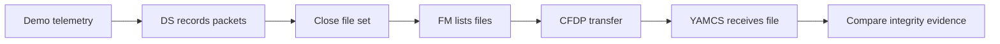

# Data Lifecycle

> **Scenario status:** Draft manual scenario using current Demo, DS, FM, CF, Radio, and YAMCS capabilities.
> The repository does not yet include one procedure that selects a returned file, verifies CFDP completion, and compares file hashes.

## Objective

Follow representative Demo telemetry from generation through onboard storage, file selection, radio downlink, and integrity review.
This scenario makes each stage visible so a successful packet display is not mistaken for a completed data product delivery.

## Prerequisites

* complete [Commissioning](commissioning.md) through Demo checkout
* confirm DS is active
* confirm Demo is enabled and producing fresh housekeeping and device telemetry
* establish a Duplex radio window with RTS 6
* choose a run identifier and record the start time

The current DS tables store Demo housekeeping and device telemetry in destination file index 0.
That destination writes time named `sv` files with the `.ds` extension under `/d`.
The file can also contain other subscribed packets, so it is a telemetry archive rather than a Demo only product.

## Phase 1 Establish the baseline

Record Demo `DEVICE_ENABLED`, `DEVICE_CONFIG`, and channels 1 through 3.
Record DS application state and the current file count or filename information available in housekeeping.
Request an FM listing for `/d` and save the result as the before state.

If the directory already contains files, do not delete them merely to simplify the scenario.
Use timestamps and the final listing to identify the file created during this run.

## Phase 2 Generate identifiable activity

Send `/DEMO/DEMO_CONFIG_CC` with a reviewed value chosen for this run.
Confirm that fresh Demo telemetry reports the new configuration.
Allow several new Demo housekeeping and device packets to be published while DS is active.

Record the first and last packet times for the activity window.
The selected value is an observation marker, not proof that the stored file contains only this activity.

## Phase 3 Close the file

Send `/DS/DS_COMMANDS/DS_CLOSE_ALL`.
Confirm that DS accepts the command without a new command error.
Wait for fresh DS housekeeping before requesting the next directory listing.

Closing the file set creates a stable transfer candidate.
Do not choose the file that DS is currently writing if a new file opens afterward.

## Phase 4 Select the actual file

Send `/FM/FM_COMMANDS/FM_GET_DIR_PKT` with `DIRECTORY` set to `/d`.
Wait for `/FM/FM_DIRLISTPKT` and compare it with the before state.

Choose the completed `.ds` file whose time and size match the activity window.
Record the exact source path, returned size, and any available timestamp.
If no suitable file appears, allow more telemetry to accumulate, close the file set again, and request a fresh listing.

## Phase 5 Transfer through the radio path

Confirm the Radio reports Duplex mode and `radio-in` is receiving telemetry.
If RTS 6 is close to completion, stop it and configure the Radio for Duplex mode before starting CFDP.

Send `/CF/CF_COMMANDS/CF_TX_FILE` with `SRCFILENAME` set to the selected `/d/<returned-file>` path.
Set `DSTFILENAME` to the reviewed destination name.
Review the Class 2, channel, destination, and preservation values shown by YAMCS.

Watch **File transfer** until the transaction reaches its defined terminal state.
Record the transaction identifier, start time, completion time, source path, destination name, and byte count where available.

## Phase 6 Review integrity

Confirm that the received file is available through the YAMCS CFDP service.
Export or otherwise access the source and destination files through an approved test method.
Compute both hashes with the same algorithm and record them with the byte counts.

The current scenario does not prescribe a source file export command because that workflow is not yet documented as a stable public interface.
Until both files can be accessed, report CFDP completion separately from content integrity.

## Expected results

| Checkpoint | Expected result |
| --- | --- |
| Baseline | Demo and DS telemetry is fresh and the initial `/d` listing is retained. |
| Activity | Demo reports the chosen configuration and publishes data during the recorded interval. |
| Storage | DS accepts `DS_CLOSE_ALL` and a completed `.ds` file appears in `/d`. |
| Selection | The chosen source path comes from the current FM response. |
| Transfer | CFDP reaches the predefined successful terminal state through a Duplex pass. |
| Integrity | Source and destination size and hash evidence agree when both files are available. |

## Stop conditions

Stop and preserve state when Demo or DS telemetry becomes stale, DS reports a command error, the Radio leaves Duplex mode, CFDP reaches a terminal failure, or the selected source file changes unexpectedly.
Do not substitute another file without recording a new selection checkpoint.

## Cleanup and evidence

Allow RTS 6 to finish or return the Radio to Receive mode.
Record the final Demo configuration and whether Demo remains enabled.

Retain both FM listings, Demo activity times, DS command result, selected file metadata, CFDP transaction, received file record, hashes, active configuration, and relevant logs.
A useful screenshot sequence shows the Demo marker, new FM file, active transfer, and completed destination record.

## Automation needed

A reviewed procedure needs a reliable way to select a filename returned by FM, pass it to CF, wait for a named CFDP result, and collect integrity evidence.
The procedure must also define timeouts, an interrupted pass result, and cleanup for partial transactions.

***
Last reviewed: 14 August 2026
